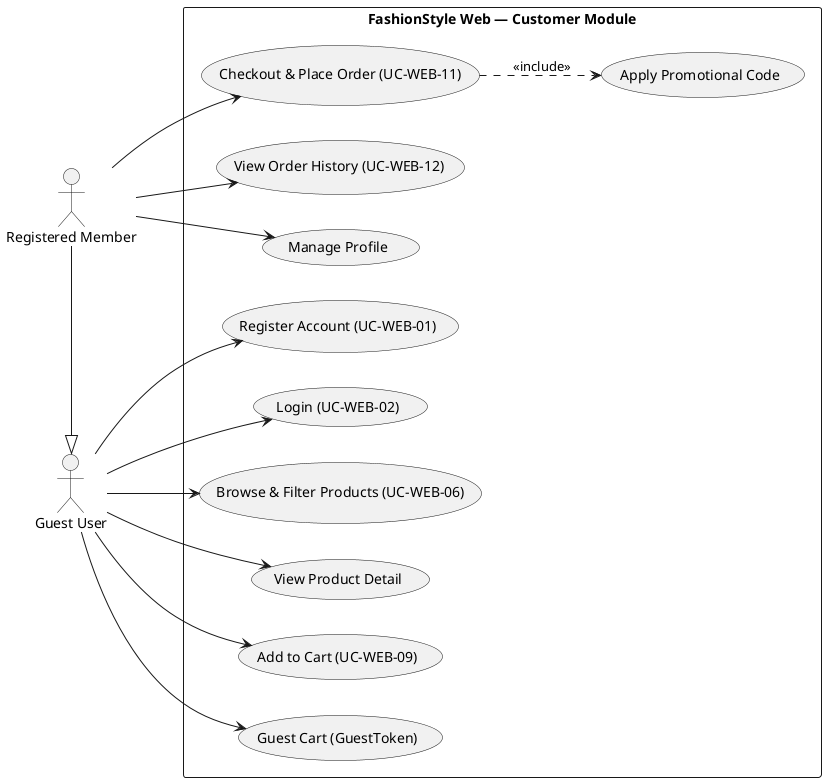
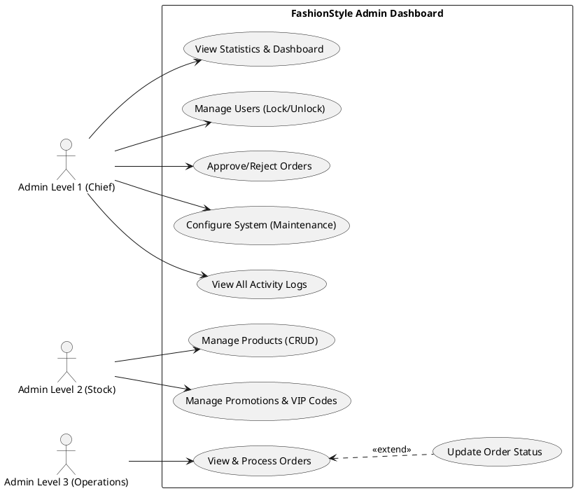
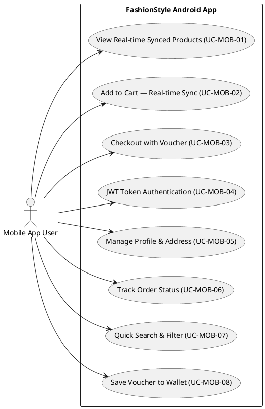

# HƯỚNG DẪN VIẾT BÁO CÁO FINAL YEAR PROJECT
## Theo yêu cầu của Final Year Project Handbook (International Edition - V1)
## Dành cho: Rubric A — System Development (Application Based Project)

---

> **Môn học:** CBBR4106 – Final Year Project  
> **Trường:** Open University Malaysia (OUM) / FPT-Greenwich  
> **Chương trình:** Bachelor of Information Technology with Honours  
> **Loại đồ án:** System Development — E-Commerce System Application + Mobile Application

---

## 📋 MỤC LỤC FILE BÁO CÁO .md (Theo đúng thứ tự Handbook yêu cầu)

```
1. TITLE PAGE
2. DECLARATION
3. ABSTRACT
4. ACKNOWLEDGEMENTS
5. TABLE OF CONTENTS
6. LIST OF TABLES
7. LIST OF FIGURES
8. LIST OF ABBREVIATIONS
─────────────────────────────
CHAPTER 1 : INTRODUCTION
CHAPTER 2 : SYSTEM ANALYSIS AND DESIGN
CHAPTER 3 : TOOLS AND ENVIRONMENTS FOR SOFTWARE DEVELOPMENT
CHAPTER 4 : IMPLEMENTATION AND EVALUATION
CHAPTER 5 : CONCLUSIONS
─────────────────────────────
REFERENCES
APPENDICES
```

---

# DEVELOPMENT OF A FASHION E-COMMERCE PLATFORM WITH MOBILE APPLICATION

*(Arial Narrow, size 18, Upper Case — dùng cho bìa)*

**[TÊN SINH VIÊN]**  
**[Mã số sinh viên]**

**OPEN UNIVERSITY MALAYSIA**  
**2026**

---

## DECLARATION

**Name:** [Tên sinh viên]  
**Matric Number:** [Mã số]

I hereby declare that this final year project is the result of my own work, except for quotations and summaries which have been duly acknowledged.

**Signature:** __________________ &nbsp;&nbsp;&nbsp;&nbsp; **Date:** __________________

---

## ABSTRACT

**DEVELOPMENT OF A FASHION E-COMMERCE PLATFORM WITH MOBILE APPLICATION**

*(Times New Roman, size 12, single spacing, không quá 250 từ)*

This project presents the development of a full-stack fashion e-commerce platform named FashionStyle, designed to provide customers with a seamless online shopping experience across web and mobile platforms. The system adopts a multi-tier architecture consisting of four integrated components: a Node.js RESTful API backend, a React-based customer web application, a React-based administrator dashboard, and an Android mobile application built with React Native. The mobile application employs a Hybrid WebView architecture, embedding the web frontend within a native Android shell to deliver consistent user experience without the need to develop a separate mobile interface. Key features include product management with inventory tracking by size and color, role-based access control for three levels of administrators, a personalized one-time promotional code system for VIP customers, real-time order processing with automated email notifications via Nodemailer, and a system configuration module allowing administrators to toggle maintenance mode and control user registration. The system was developed and tested on a local development environment using an Android Emulator connected via ADB Reverse Tunnel to ensure reliable communication between the mobile app and the local backend services.

**Keywords:** E-Commerce, React Native, WebView, Node.js, Full-Stack, Mobile Application

---

## ACKNOWLEDGEMENTS

I would like to take this opportunity to express my gratitude and appreciation to my supervisor, **[Tên supervisor]**, for his/her guidance, patience and invaluable advice throughout this project.

I also would like to express my appreciation to my family and friends for their endless support whenever I face problems. Without the mentioned parties, it is impossible for me to complete this project report successfully.

**THANK YOU.**

**[TÊN SINH VIÊN]**  
*28 March, 2026*

---

## TABLE OF CONTENTS

| Section | Page |
|---------|------|
| DECLARATION | ii |
| ABSTRACT | iii |
| ACKNOWLEDGEMENTS | iv |
| TABLE OF CONTENTS | v |
| LIST OF TABLES | vi |
| LIST OF FIGURES | vii |
| LIST OF ABBREVIATIONS | viii |
| **CHAPTER 1: INTRODUCTION** | 1 |
| 1.1 Background to the Study | 1 |
| 1.2 Problem Statement | 2 |
| 1.3 Objectives of the Study | 3 |
| 1.4 Scope and Limitation | 4 |
| 1.5 Implementation Plan | 5 |
| **CHAPTER 2: SYSTEM ANALYSIS AND DESIGN** | 6 |
| 2.1 Feasibility Studies | 6 |
| 2.2 Requirement Methods | 8 |
| 2.3 System Development Methods | 10 |
| 2.4 Data and Process Modelling Diagrams | 11 |
| 2.5 Database Design | 13 |
| 2.6 Interface Design | 18 |
| **CHAPTER 3: TOOLS AND ENVIRONMENTS FOR SOFTWARE DEVELOPMENT** | 22 |
| 3.1 Programming Languages & Frameworks | 22 |
| 3.2 Database Environment | 24 |
| 3.3 Development Tools & IDEs | 25 |
| 3.4 Key Libraries and Integrations | 26 |
| **CHAPTER 4: IMPLEMENTATION AND EVALUATION** | 28 |
| 4.1 System Implementation and Installation | 28 |
| 4.2 Core Features Implementation | 31 |
| 4.3 System User Guides | 33 |
| 4.4 Testing Plan and Output (Evaluation) | 37 |
| **CHAPTER 5: CONCLUSIONS** | 42 |
| 5.1 Summary of Main Findings | 42 |
| 5.2 Discussion and Implications | 43 |
| 5.3 Limitations of the System | 44 |
| 5.4 Future Development | 45 |
| REFERENCES | 59 |
| APPENDICES | 61 |

---

## LIST OF TABLES

| Table | Title | Page |
|-------|-------|------|
| Table 2.1 | Functional Requirements (FR01–FR10) | 17 |
| Table 2.2 | Non-Functional Requirements (NFR01–NFR05) | 18 |
| Table 2.3 | Cost-Benefit Analysis | 16 |
| Table 2.4 | Implementation Plan (7 Phases) | 19 |
| Table 2.5 | Database Schema — Users Table | 26 |
| Table 2.6 | Database Schema — Products Table | 26 |
| Table 2.7 | Database Schema — Orders Table | 27 |
| Table 2.8 | Database Schema — UserVouchers Table | 27 |
| Table 3.1 | Software Prerequisites | 30 |
| Table 4.1 | Test Cases — Authentication Module (UC-WEB-01, UC-WEB-02) | 44 |
| Table 4.2 | Test Cases — Product Management Module (UC-WEB-06, UC-WEB-07) | 46 |
| Table 4.3 | Test Cases — Order Processing Module (UC-WEB-11, UC-WEB-12) | 48 |
| Table 4.4 | Test Cases — Admin Management Module (UC-ADM-01 to UC-ADM-08) | 50 |

---

## LIST OF FIGURES

| Figure | Title | Page |
|--------|-------|------|
| Figure 2.1 | Multi-Tier System Architecture Diagram | 14 |
| Figure 2.2 | Use Case Diagram — Customer / Guest (UC-WEB-01 to UC-WEB-12) | 18 |
| Figure 2.3 | Use Case Diagram — Administrator: Level 1, 2, 3 (UC-ADM-01 to UC-ADM-08) | 19 |
| Figure 2.4 | Use Case Diagram — Mobile App User (UC-MOB-01 to UC-MOB-06) | 20 |
| Figure 2.5 | Data Flow Diagram (DFD) Level 0 | 21 |
| Figure 2.6 | ERD — Group 1: System & User Management (Users, User_Password_Reset, Admin_Activity_Logs, System_Config, Notifications) | 22 |
| Figure 2.7 | ERD — Group 2: Product Management (Categories, Products, Product_Costs, Product_Sizes, Colors, Product_Colors, Image) | 23 |
| Figure 2.8 | ERD — Group 3: Promotions & Interaction (Promotions, Promotions_Code, UserVouchers, Reviews) | 24 |
| Figure 2.9 | ERD — Group 4: Shopping & Transactions (Shopping_Carts, Cart_Items, Orders, OrderDetails, Payment_Transactions) | 25 |
| Figure 2.10 | Interface Design — Customer Homepage | 28 |
| Figure 2.11 | Interface Design — Product Detail Page | 29 |
| Figure 2.12 | Interface Design — Admin Dashboard | 30 |
| Figure 2.13 | Interface Design — Mobile App (Android) | 31 |
| Figure 4.1 | Screenshot — Customer Homepage (Live) | 38 |
| Figure 4.2 | Screenshot — Product Detail Page (Live) | 39 |
| Figure 4.3 | Screenshot — Admin Dashboard (Live) | 41 |
| Figure 4.4 | Screenshot — Mobile App Running on Android Emulator | 43 |

---

## LIST OF ABBREVIATIONS

| Abbreviation | Full Form |
|-------------|-----------|
| API | Application Programming Interface |
| APK | Android Package Kit |
| ADB | Android Debug Bridge |
| CRUD | Create, Read, Update, Delete |
| DFD | Data Flow Diagram |
| ERD | Entity Relationship Diagram |
| HTTP | Hypertext Transfer Protocol |
| IT | Information Technology |
| JWT | JSON Web Token |
| OUM | Open University Malaysia |
| REST | Representational State Transfer |
| SDLC | Software Development Life Cycle |
| SQL | Structured Query Language |
| UI | User Interface |
| UX | User Experience |

---

---

## 1.1 Background to the Study

The rapid growth of e-commerce has fundamentally transformed the way consumers purchase goods and services globally. According to Statista (2024), global e-commerce sales are projected to surpass USD 7 trillion by 2025, driven by the growing penetration of smartphones and widespread internet access in both developed and developing markets. In Vietnam, the digital economy has experienced significant expansion, with online retail emerging as a dominant channel for fashion and lifestyle products among consumers aged 18 to 45.

The fashion and apparel industry represents one of the most competitive and dynamic sectors in e-commerce. Major global platforms such as Shopify, WooCommerce, and regional giants like Shopee and Lazada have set high consumer expectations for seamless, integrated shopping experiences across both web and mobile interfaces. However, many small and medium-sized fashion enterprises (SMEs) in Vietnam still lack affordable, technically robust integrated digital solutions (Laudon & Traver, 2021).

Specifically, many local fashion retailers operate without a unified management system, leading to fragmented customer journeys, poor visibility into stock levels, and significant manual effort in order management. The absence of a mobile application further removes these businesses from a growing segment of mobile-first consumers who prefer to browse and purchase via their smartphones. Research indicates that mobile commerce accounts for over 60% of global e-commerce traffic (Statista, 2024), highlighting the commercial urgency for SMEs to adopt mobile-ready solutions.

This project, **FashionStyle**, directly addresses these challenges by developing a comprehensive full-stack e-commerce solution. The platform integrates a customer-facing web application, an administrator dashboard, and an Android mobile application, all powered by a centralised backend API and MySQL database. By leveraging modern open-source technologies including Node.js, React 18, and React Native 0.84.1, FashionStyle delivers a scalable, maintainable, and commercially viable solution that SMEs can deploy and operate with minimal technical overhead.

The system adopts a Hybrid WebView architecture for its Android application, embedding the fully-responsive web interface within a native React Native shell. This approach eliminates the need to develop and maintain two separate codebases for web and mobile, significantly reducing development cost and time-to-market — a key advantage for small businesses with limited resources.

## 1.2 Problem Statement

Despite the growing penetration of e-commerce, small and medium-sized fashion retailers continue to face a series of critical operational and technical challenges that hamper their competitiveness in the digital marketplace:

**Problem 1 — Lack of Integrated Mobile Experience:**
Most small retailer websites are not optimised for mobile devices, resulting in poor user experience and low mobile conversion rates. The absence of a dedicated mobile application means businesses miss significant revenue opportunities from mobile-first consumers. Users on mobile browsers frequently encounter layout issues, slow navigation, and limited interactive features compared to desktop experiences.

**Problem 2 — Inefficient and Manual Order Management:**
Without an integrated order management system, retailers rely on manual processes — phone calls, spreadsheets, and messaging apps — to handle order confirmations, status updates, and customer communications. These manual workflows are error-prone, time-consuming, and create unacceptable delays in customer communication, which negatively impacts customer satisfaction and repeat purchase rates.

**Problem 3 — Inadequate Inventory Control (Size and Colour Tracking):**
Fashion retail requires precise tracking of stock by both size (S, M, L, XL) and colour. Without a sophisticated inventory management system, businesses frequently encounter overselling, incorrect fulfilment, and stock discrepancies. This leads to customer complaints, returns, and reputational damage.

**Problem 4 — Absence of Personalised Promotional Systems:**
Effective digital marketing requires the ability to create targeted, personalised promotional campaigns. Small retailers lack the technical infrastructure to issue, track, and validate personalised promotional codes at the customer level, limiting their ability to reward VIP customers and drive repeat purchases.

**Problem 5 — No Centralised Administrative Control:**
With multiple operational roles — procurement, customer service, logistics — small retailers need role-differentiated administrative access. Without a multi-tier admin system, either all staff have full access (creating security risks) or manual processes are required to coordinate between departments.

## 1.3 Objectives of the Study

The primary goal of this project is to design, develop, and evaluate a comprehensive e-commerce platform that resolves the identified problems. The specific objectives are:

1. **Objective 1:** To design and develop a full-stack e-commerce platform comprising a RESTful API backend (Node.js + Express.js), a customer-facing web application (React 18), and a role-differentiated administrator dashboard (React 19 + PrimeReact), enabling end-to-end product catalogue management, cart functionality, and order processing.

2. **Objective 2:** To develop an Android mobile application using React Native 0.84.1, leveraging a Hybrid WebView architecture to embed the responsive web interface within a native Android shell, providing a seamless mobile shopping experience without the overhead of maintaining a separate mobile codebase.

3. **Objective 3:** To implement a Role-Based Access Control (RBAC) system supporting three distinct administrator levels — Admin Level 1 (Chief), Admin Level 2 (Stock Management), and Admin Level 3 (Operations) — each with precisely scoped functionality to ensure operational security and efficiency.

4. **Objective 4:** To develop an automated, asynchronous order management workflow that triggers HTML-formatted email notifications to both customers and administrators upon order placement and status changes, using Nodemailer integrated with Gmail SMTP.

5. **Objective 5:** To implement a personalised, single-use VIP promotional code system linked to individual user accounts through the `UserVouchers` table, ensuring that promotional codes cannot be transferred between accounts or reused after redemption.

## 1.4 Scope and Limitation

### Scope

The FashionStyle system covers the following functional areas within the scope of this project:

**Customer Module:**
- User registration with email and full name validation
- User login with JWT-based session management (7-day expiry)
- Product browsing by category, colour, price range, and keyword search
- Product detail view with size and colour selection
- Shopping cart management for both authenticated users (JWT) and guest visitors (GuestToken-based anonymous cart)
- Checkout process supporting Cash on Delivery (COD) and simulated online banking payment
- Promotional code application and real-time order total recalculation
- Order history and order status tracking
- User profile management and password update
- Bilingual interface (English and Vietnamese) via i18next internationalisation

**Administrator Module:**
- Three-tier role-based admin dashboard automatically provisioned on server startup
- Admin Level 1: Full system access — user management (lock/unlock), system configuration (maintenance mode, registration toggle), order final approval/rejection, all statistics and logs
- Admin Level 2: Product catalogue management (CRUD), image uploads (Multer), category/colour/size management, promotional code creation and VIP assignment
- Admin Level 3: Order queue management, order status updates, order fulfilment workflow
- Activity logging for all admin actions with timestamp and action type

**Mobile Module:**
- Android APK built with React Native 0.84.1
- Hybrid WebView embedding the full customer web application
- Hardware back button interception (prevents app exit, navigates WebView history)
- JWT token persistence via WebView `domStorage` (localStorage sync)
- ADB Reverse Tunnel for local development connectivity

### Limitation

The following aspects are explicitly outside the scope of this project:

- **Platform:** The mobile application targets Android exclusively. iOS support (requiring macOS + Xcode) is not implemented.
- **Payment Gateway:** No real payment provider (VNPay, Stripe, PayPal) is integrated. Payment simulation is for demonstration purposes only.
- **Deployment:** The system operates in a local development environment. Production cloud hosting (AWS, Google Cloud, Vercel) is not configured.
- **Push Notifications:** Mobile push notifications via FCM (Firebase Cloud Messaging) are not implemented; email notifications are the primary notification channel.
- **Product Reviews Moderation:** Reviews can be submitted by guests without moderation workflow.

## 1.5 Implementation Plan

The project was executed across seven phases over a 16-week period, following the Rapid Application Development (RAD) methodology with iterative design and testing cycles.

| Phase | Activity | Duration | Key Deliverable |
|-------|----------|----------|-----------------|
| Phase 1 | Requirements Analysis & System Design | 2 weeks | System Architecture Document, ERD, Use Case Diagrams |
| Phase 2 | Backend API Development | 3 weeks | Node.js REST API with 13 endpoint groups, JWT Auth |
| Phase 3 | Customer Web App Development | 4 weeks | React 18 Web App (Port 5174), Redux Cart, Checkout |
| Phase 4 | Admin Dashboard Development | 2 weeks | React 19 Admin Panel, RBAC, Stats Dashboard |
| Phase 5 | Android Mobile App Development | 2 weeks | React Native APK, WebView, ADB Tunnel |
| Phase 6 | System Integration & Testing | 2 weeks | Integration Tests, Black Box Test Cases |
| Phase 7 | Documentation & Report Writing | 1 week | Final Year Project Report |
| **Total** | | **16 weeks** | **Complete FashionStyle System** |

The most time-intensive phase was Phase 3 (Customer Web App Development), as this component serves as the foundation for the mobile application interface and required careful responsive design work to ensure compatibility across both desktop browsers and the Android WebView rendering engine.

---

# CHAPTER 2: SYSTEM ANALYSIS AND DESIGN

## 2.1 Feasibility Studies

### 2.1.1 Technical Feasibility

The FashionStyle system utilises widely adopted, industry-standard open-source technologies. Node.js (v22.11.0) provides event-driven, non-blocking I/O that is well-suited for handling concurrent API requests in an e-commerce environment. React 18 introduced concurrent rendering capabilities, improving perceived performance for users. React Native 0.84.1 is the industry-standard framework for cross-platform mobile development (Meta Platforms, 2024b).

All dependencies — Express.js, MySQL2, JWT, bcryptjs, Multer, Nodemailer, React Router, Redux Toolkit, Axios, PrimeReact, Zustand — are freely available through npm, the Node Package Manager. No proprietary software or paid licences are required at any stage of development or operation.

The development environment requires a Windows 10/11 workstation with the following installed software:
- Node.js v22.11.0 or higher
- MySQL 8.0 Community Edition
- Android Studio (Ladybug release) with Android SDK
- Visual Studio Code with ESLint and Prettier extensions
- Git for version control

This technology stack is well-documented, has active community support, and aligns with industry practices for full-stack web and mobile development (Pressman & Maxim, 2019).

### 2.1.2 Operational Feasibility

The system is designed with operational ease as a core design principle. The Role-Based Access Control (RBAC) system ensures that each of the three administrator levels has a precisely scoped interface, reducing cognitive load, minimising training time, and eliminating the risk of accidental data corruption by unauthorised staff.

The customer interface is designed following mobile-first responsive design principles, ensuring accessibility across device sizes from 375px (iPhone SE) to 1440px (desktop). The bilingual interface (English and Vietnamese) using i18next further expands the system's operational reach.

The automatic admin account provisioning on server startup (`initAdminAccounts()` function in `server.js`) ensures that the system is always recoverable — even in the event of an accidental account deletion — without requiring manual database intervention.

### 2.1.3 Cost-Benefit Analysis

| Item | Estimated Cost |
|------|----------------|
| Development Tools (VS Code, Android Studio) | Free (Open Source) |
| Backend Framework (Node.js, Express.js) | Free (Open Source) |
| Frontend Framework (React 18, React 19, Vite) | Free (Open Source) |
| Mobile Framework (React Native 0.84.1) | Free (Open Source) |
| Database (MySQL 8.0 Community Edition) | Free (Open Source) |
| UI Component Library (PrimeReact) | Free (Community Tier) |
| Email Service (Nodemailer + Gmail SMTP) | Free (within Gmail limits) |
| Hosting (Local Development Environment) | USD 0 |
| **Total Development Cost** | **USD 0** |

**Quantifiable Benefits:**
- Elimination of manual order tracking workflows, estimated to save 2–4 staff-hours per day
- Reduction in overselling incidents through size/colour-based inventory tracking
- Expansion of customer reach through mobile application deployment on the Android platform
- Increased promotional effectiveness through personalised, single-use VIP discount codes
- Real-time system configuration capability (maintenance mode, registration toggle) without requiring code deployment

## 2.2 Requirement Methods

### 3.2.1 Functional Requirements

| ID | Requirement | Priority |
|----|-------------|----------|
| FR01 | Customers can register, log in, and manage their profile | High |
| FR02 | Customers can browse products by category, colour, and price | High |
| FR03 | Customers can add products to cart and checkout (COD/Online) | High |
| FR04 | Guests can add items to cart using a GuestToken | Medium |
| FR05 | Admin 1 can manage all system configurations | High |
| FR06 | Admin 2 can manage products and promotional codes | High |
| FR07 | Admin 3 can process and update order status | High |
| FR08 | The system sends email notifications for orders | High |
| FR09 | The mobile app embeds the web interface on Android | High |
| FR10 | Admin 1 can toggle maintenance mode via dashboard | Medium |

### 3.2.2 Non-Functional Requirements

| ID | Requirement |
|----|-------------|
| NFR01 | Response time for API calls must be under 500ms |
| NFR02 | The web interface must be fully responsive on mobile screens (375px–1440px) |
| NFR03 | JWT tokens for customers expire after 7 days |
| NFR04 | Admin JWT tokens do not expire |
| NFR05 | The system must support English and Vietnamese languages |

## 2.3 System Development Methods

This project adopts the **Rapid Application Development (RAD)** methodology combined with elements of the **Software Development Life Cycle (SDLC)** Waterfall model. RAD was selected due to the iterative nature of the user interface design requirements, which necessitated frequent review and refinement cycles across the web and mobile components.

The development process followed these phases:
1. Requirements and Planning
2. User Design and Prototyping
3. Construction and Coding
4. Cutover and Testing

## 2.4 Data and Process Modelling Diagrams

### 2.4.1 System Architecture Diagram

**Figure 2.1 — FashionStyle Multi-Tier System Architecture**

```
╔══════════════════════════════════════════════════════════════════╗
║              PRESENTATION TIER (Client Layer)                    ║
║                                                                  ║
║  ┌─────────────────┐  ┌──────────────────┐  ┌───────────────┐   ║
║  │  Customer Web   │  │  Admin Dashboard │  │ FashionStyle  │   ║
║  │  (React+Vite)   │  │  (React+Vite)    │  │ Android App   │   ║
║  │  Port: 5174     │  │  Port: 5173      │  │ (React Native │   ║
║  │  Tailwind CSS   │  │  PrimeReact UI   │  │  WebView)     │   ║
║  │  Redux+Axios    │  │  Zustand+Axios   │  │               │   ║
║  └────────┬────────┘  └────────┬─────────┘  └──────┬────────┘   ║
║           │  Axios HTTP        │  Axios HTTP         │ ADB Reverse║
╚═══════════╪════════════════════╪═════════════════════╪══════════╝
            │                   │                     │
            └─────────┬─────────┘                     │
                      │   HTTP REST API (JSON)         │
╔═════════════════════▼═════════════════════════════════▼══════════╗
║              APPLICATION TIER (Business Logic)                   ║
║                                                                  ║
║            Backend Project — Node.js + Express.js                ║
║                       Port: 8080                                 ║
║   ┌──────────┐  ┌────────────┐  ┌──────────┐  ┌─────────────┐  ║
║   │JWT Auth  │  │13 API Route│  │ Multer   │  │  Nodemailer │  ║
║   │Middleware│  │  Groups    │  │(Uploads) │  │(Email Async)│  ║
║   └──────────┘  └────────────┘  └──────────┘  └─────────────┘  ║
╚══════════════════════════════┬═══════════════════════════════════╝
                               │  MySQL2 TCP Connection
╔══════════════════════════════▼═══════════════════════════════════╗
║                  DATA TIER (Persistence Layer)                   ║
║                                                                  ║
║                  MySQL Database — Port 3306                      ║
║   Users · Products · Categories · Orders · Cart · Promotions    ║
║   Colors · Sizes · Reviews · UserVouchers · AdminLogs · Config   ║
╚══════════════════════════════════════════════════════════════════╝
```

**Description:** The FashionStyle platform follows a three-tier architecture. The Presentation Tier consists of three independent client applications: the customer web application (React 18 + Vite, Port 5174), the administrator dashboard (React 19 + Vite + PrimeReact, Port 5173), and the Android mobile application (React Native 0.84.1 with Hybrid WebView). All clients communicate exclusively with the Application Tier through HTTP REST API calls using the Axios library. The Application Tier is powered by a Node.js + Express.js server (Port 8080) that handles authentication (JWT), file uploads (Multer), and automated email notifications (Nodemailer). The Data Tier consists of a single centralised MySQL 8.0 database with 21 tables, ensuring all clients share consistent data in real-time.

### 2.4.2 Use Case Diagrams

**Use Case Diagram — Customer (Web) — Figure 2.2**



**Use Case Diagram — Administrator (3 Levels) — Figure 2.3**



**Use Case Diagram — Mobile App — Figure 2.4**



### 2.4.3 Data Flow Diagram (DFD) Level 0 — Figure 2.5

The DFD Level 0 (Context Diagram) illustrates the high-level flow of data between the four primary actors of the FashionStyle system and the central processing engine.

```
╔═══════════════════════════════════════════════════════════════════════╗
║               DFD LEVEL 0 — FashionStyle System Context              ║
╚═══════════════════════════════════════════════════════════════════════╝

  ┌──────────────┐         ① Browse/Search Request          ╔═══════════════════╗
  │              │ ─────────────────────────────────────────►║                   ║
  │   CUSTOMER   │         ② Product List / Details          ║                   ║
  │  (Web + App) │ ◄─────────────────────────────────────────║                   ║
  │              │         ③ Add to Cart / Place Order        ║   FASHIONSTYLE    ║
  │              │ ─────────────────────────────────────────►║     SYSTEM        ║
  │              │         ④ Order Confirmation + Email       ║  (Node.js API     ║
  │              │ ◄─────────────────────────────────────────║   Port: 8080)     ║
  └──────────────┘         ⑤ Submit Login / Register         ║                   ║
                           ─────────────────────────────────►║                   ║
                           ⑥ JWT Token / Auth Response        ║                   ║
                           ◄─────────────────────────────────║                   ║
  ┌──────────────┐         ⑦ Login to Admin Panel            ║                   ║
  │              │ ─────────────────────────────────────────►║                   ║
  │    ADMIN     │         ⑧ Dashboard Statistics / Reports  ║                   ║
  │  (3 Levels)  │ ◄─────────────────────────────────────────║                   ║
  │              │         ⑨ Manage Products/Orders/Users     ║                   ║
  │              │ ─────────────────────────────────────────►║                   ║
  │              │         ⑩ System Config Changes            ║                   ║
  │              │ ─────────────────────────────────────────►║                   ║
  └──────────────┘                                           ╚═══════════╤═══════╝
                                                                         │
                                                  ⑪ Read/Write Queries   │
                                                                         ▼
                                                             ╔═══════════════════╗
  ┌──────────────┐         ⑫ Email Notifications             ║                   ║
  │              │ ◄─────────────────────────────────────────║     DATABASE      ║
  │    EMAIL     │                                           ║  (MySQL 8.0)      ║
  │   SERVICE    │                                           ║  21 Tables        ║
  │  (Nodemailer)│                                           ║                   ║
  └──────────────┘                                           ╚═══════════════════╝

── Data Flows Description ──────────────────────────────────────────────────────
  ①②  Product browsing: Customer requests product listings; System returns data
  ③④  Order placement: Customer submits order; System confirms + sends email
  ⑤⑥  Authentication: Customer/Admin sends credentials; System returns JWT token
  ⑦⑧  Admin access: Admin logs in and retrieves statistics from System
  ⑨⑩  Admin management: Admin pushes product/order/config updates to System
  ⑪   Persistence: System performs all CRUD operations on the MySQL database
  ⑫   Notifications: System triggers Nodemailer to send transactional emails
```

**Explanation of Data Flows:**

The customer interacts with the system through two channels — the web application and the Android mobile app — both of which communicate identically with the backend API. All product browsing, cart management, and order placement data flows through REST API endpoints protected by JWT middleware. The administrator panel provides a separate interface where three different admin levels interact with their respective scopes: Admin Level 1 handles system-wide configuration and order approval; Admin Level 2 manages the product catalogue and promotional codes; Admin Level 3 processes incoming orders and updates shipment statuses. All persistent data — products, users, orders, carts, promotions — is stored in the centralised MySQL database, ensuring real-time consistency across all client applications.

## 2.5 Database Design

### 3.5.1 Entity-Relationship Diagram (ERD)

*(Nhúng ảnh ERD tại đây)*

### 3.5.2 Database Schema

**Table: Users**

| Column | Type | Constraints |
|--------|------|-------------|
| UserID | INT | PRIMARY KEY, AUTO_INCREMENT |
| FullName | VARCHAR(255) | NOT NULL |
| Email | VARCHAR(255) | UNIQUE, NOT NULL |
| PasswordHash | VARCHAR(255) | NOT NULL |
| Role | ENUM('Customer','Admin') | DEFAULT 'Customer' |
| IsActive | TINYINT(1) | DEFAULT 1 |
| CanDeleteProduct | TINYINT(1) | DEFAULT 0 |
| CreatedAt | DATETIME | DEFAULT CURRENT_TIMESTAMP |

**Table: Products**

| Column | Type | Constraints |
|--------|------|-------------|
| ProductID | INT | PRIMARY KEY, AUTO_INCREMENT |
| Name | VARCHAR(255) | NOT NULL |
| Description | TEXT | |
| Price | DECIMAL(10,2) | NOT NULL |
| CategoryID | INT | FOREIGN KEY → Categories |
| ImageURL | VARCHAR(500) | |
| CreatedAt | DATETIME | DEFAULT CURRENT_TIMESTAMP |

**Table: Orders**

| Column | Type | Constraints |
|--------|------|-------------|
| OrderID | INT | PRIMARY KEY, AUTO_INCREMENT |
| UserID | INT | FOREIGN KEY → Users |
| TotalAmount | DECIMAL(10,2) | NOT NULL |
| Status | VARCHAR(50) | DEFAULT 'PENDING' |
| PaymentMethod | VARCHAR(50) | |
| ShippingAddress | TEXT | |
| CreatedAt | DATETIME | DEFAULT CURRENT_TIMESTAMP |

**Table: Promotions**

| Column | Type | Constraints |
|--------|------|-------------|
| PromotionID | INT | PRIMARY KEY, AUTO_INCREMENT |
| Code | VARCHAR(100) | UNIQUE |
| DiscountPercent | DECIMAL(5,2) | |
| IsUsed | TINYINT(1) | DEFAULT 0 |
| IsActive | TINYINT(1) | DEFAULT 1 |

**Table: UserVouchers**

| Column | Type | Constraints |
|--------|------|-------------|
| VoucherID | INT | PRIMARY KEY, AUTO_INCREMENT |
| UserID | INT | FOREIGN KEY → Users |
| PromotionID | INT | FOREIGN KEY → Promotions |
| IsUsed | TINYINT(1) | DEFAULT 0 |
| AssignedAt | DATETIME | DEFAULT CURRENT_TIMESTAMP |

## 2.6 Interface Design

*(Insert screenshots or wireframes of main screens: Homepage, Product Detail, Cart, Checkout, Admin Dashboard, Mobile App)*

---

# CHAPTER 3: TOOLS AND ENVIRONMENTS FOR SOFTWARE DEVELOPMENT

## 3.1 Programming Languages & Frameworks

### 3.1.1 Backend: Node.js and Express.js

The backend of the FashionStyle system is built on **Node.js (v22.11.0)**, a JavaScript runtime that executes code outside the browser using Google's V8 engine. Node.js is specifically well-suited for I/O-intensive applications such as e-commerce APIs because of its non-blocking event-driven architecture, which allows it to handle thousands of concurrent HTTP connections without spawning expensive OS threads (OpenJS Foundation, 2024).

**Express.js** is used as the HTTP server framework. Express provides a minimal, unopinionated routing layer that maps incoming HTTP requests (GET, POST, PUT, DELETE, PATCH) to handler functions. The FashionStyle backend is structured into 13 API route groups, each responsible for a specific domain: authentication, products, categories, colours, cart, orders, promotions, users, statistics, reviews, admin logs, notifications, and system configuration.

### 3.1.2 Frontend (Web): React 18 and Vite

The customer web application is built using **React 18** with the **Vite** build tool. React is a component-based JavaScript library maintained by Meta Platforms (2024a) that enables developers to build dynamic, reactive user interfaces through declarative rendering and a virtual DOM diffing algorithm.

Key React 18 features leveraged in this project include:
- **Concurrent Rendering:** Improves perceived performance by allowing React to interrupt and resume rendering work.
- **Automatic Batching:** Groups multiple state updates into a single re-render cycle, reducing unnecessary DOM operations.
- **React Router v6:** Enables client-side navigation between pages (Home, Shop, Product Detail, Cart, Checkout, Order History) without full page reloads.

**Vite** serves as the frontend development server and build tool, offering near-instantaneous Hot Module Replacement (HMR) during development, significantly improving developer productivity.

**Redux Toolkit** manages global state for the authentication slice (user login status and JWT token) and the shopping cart slice (items, quantities, totals). **Axios** is configured with a shared instance pointing to the backend API base URL (`http://localhost:8080/api`), ensuring consistent headers and error handling across all API calls.

### 3.1.3 Mobile Development: React Native 0.84.1 (Hybrid WebView)

The Android mobile application is developed using **React Native 0.84.1**, the industry-standard framework for cross-platform mobile development (Meta Platforms, 2024b). The application adopts a **Hybrid WebView Architecture**, in which the entire customer web application is embedded within a native Android shell using the `react-native-webview` package (React Native Community, 2024).

This architecture decision was made based on the following rationale:
1. **Code Reuse:** The web frontend (React 18) serves as both the desktop web interface and the mobile app interface, eliminating the need for a separate mobile UI codebase.
2. **Instant Updates:** Any changes deployed to the web server are immediately reflected in the mobile app without requiring a new APK release or user update.
3. **ADB Reverse Tunnel:** During development, Android Debug Bridge (ADB) port forwarding allows the Android emulator to reach the local development servers on the host machine.

The key native implementation in `App.tsx` includes:
- `BackHandler.addEventListener` for hardware back button interception
- `domStorageEnabled={true}` to allow the WebView to use `localStorage` for JWT token persistence
- Loading spinner component displayed only during the initial page load
- Custom error screen for HTTP errors and network failures

## 3.2 Database Environment: MySQL 8.0

**MySQL 8.0** serves as the relational database management system (RDBMS) for the FashionStyle platform. MySQL was selected over alternatives (PostgreSQL, MongoDB, SQLite) for the following reasons:

1. **ACID Compliance:** MySQL 8.0 with InnoDB storage engine guarantees Atomicity, Consistency, Isolation, and Durability for all transactions. This is critical for order placement and promotional code redemption operations where partial failures could cause data inconsistency.

2. **Relational Data Model:** The FashionStyle business domain naturally maps to a relational schema. Products have categories; orders have order items, which reference products; user vouchers link users to promotions. Foreign key constraints enforce referential integrity at the database level.

3. **Connection Pooling:** The `mysql2` Node.js driver is configured with a connection pool (`db.js`), allowing the backend to reuse established database connections rather than creating a new TCP connection for each query, significantly improving API throughput.

The database schema consists of **21 tables** organised into five functional groups:

| Group | Tables | Purpose |
|-------|--------|---------|
| System & Users | Users, Admin_Activity_Logs, system_config | Authentication, RBAC, system settings |
| Products & Variants | Products, Categories, Colors, Product_Colors, Product_Sizes | Catalogue and inventory |
| Promotions | Promotions, UserVouchers | Discount codes and VIP assignment |
| Cart & Guest | Shopping_Carts, Cart_Items | Persistent cart for users and guests |
| Orders & Finance | Orders, OrderDetails, OrderHistoryLog | Transactional records |

## 3.3 Development Tools & IDEs

### 3.3.1 Visual Studio Code
**Visual Studio Code (VS Code)** is the primary code editor used throughout this project. Its rich extension ecosystem provides IntelliSense auto-completion, integrated Git controls, and real-time error highlighting via ESLint. Key extensions used:
- **ESLint:** Enforces JavaScript/TypeScript code quality rules.
- **Prettier:** Automatic code formatting on file save.
- **REST Client:** HTTP request testing directly within the editor.
- **GitLens:** Enhanced Git history visualisation.

### 3.3.2 Android Studio (Ladybug)
**Android Studio (Ladybug release)** is used to manage the Android Virtual Device (AVD) emulator that runs the FashionStyle Android APK during development. The emulator simulates a Pixel 6 device (API Level 35 — Android 15) providing a realistic test environment.

The ADB Reverse Tunnel configuration (`adb reverse tcp:8080 tcp:8080`, `adb reverse tcp:5174 tcp:5174`, `adb reverse tcp:8081 tcp:8081`) maps the Android emulator's localhost ports to the corresponding development servers running on the host Windows machine.

### 3.3.3 Postman / Insomnia
API endpoints are validated using **Postman** prior to frontend and mobile integration. All 13 endpoint groups (auth, products, orders, etc.) are tested for correct HTTP status codes, JSON response structure, JWT authentication middleware enforcement, and role-level access control.

### 3.3.4 Git & GitHub
All source code is managed using **Git** for version control, with the remote repository hosted on **GitHub** at `https://github.com/TungVuk4/Final-Project`. Git allows for atomic commits, branch-based feature development, and a full history audit trail of all changes made throughout the 16-week development period.

## 3.4 Key Libraries and Integrations

### 3.4.1 JSON Web Tokens (JWT) and bcryptjs

**JWT (JSON Web Token)** provides stateless authentication across the FashionStyle platform. Upon successful login, the backend generates a signed JWT token using `jsonwebtoken` and the `JWT_SECRET` environment variable. The token is returned to the client, which stores it in `localStorage` (web) or WebView `domStorage` (mobile).

Subsequent authenticated requests include the token in the `Authorization: Bearer <token>` header. The `requireAuth` middleware (`middlewares/auth.js`) validates the token on every protected route. Three specialized middleware functions enforce role-level access:
- `requireAuth`: Basic authentication check (any valid user)
- `requireAdmin`: Requires Role = 'Admin'
- `requireAdminLevel(level)`: Validates specific admin permission flags

**bcryptjs** is used to hash user passwords before storage. Password comparison during login uses `bcrypt.compare()`, ensuring that plain-text passwords are never stored or transmitted.

**Token Expiry Policy:**
- Customer JWT tokens: Expire after 7 days (`expiresIn: '7d'`)
- Admin JWT tokens: No expiry (`expiresIn` not set)

### 3.4.2 Nodemailer (Email Service)

**Nodemailer** is integrated with Gmail SMTP to send HTML-formatted transactional emails. The email service operates **asynchronously** — meaning the backend API returns its response to the client immediately, without waiting for the email to be sent. This design ensures that email delivery failures do not impact the order placement API's response time.

Email types implemented:
- **Order Confirmation Email** → Sent to customer upon order placement
- **New Order Alert Email** → Sent to Admin Level 3 upon order placement
- **Order Status Update Email** → Sent to customer when Admin updates order status
- **Password Reset OTP Email** → Sent to customer upon password reset request

### 3.4.3 Axios, React Router, Redux and Zustand

**Axios** is configured as a shared HTTP client instance for both the customer web app and the admin dashboard. A shared configuration (`axios/custom.ts`) sets the `baseURL` to `http://localhost:8080/api`, ensuring all API calls use a consistent endpoint prefix.

**React Router v6** (web) and **React Router v7** (admin) provide client-side routing, enabling single-page application navigation without full page reloads. Protected routes redirect unauthenticated users to the login page.

**Redux Toolkit** manages global state on the customer web app — specifically the `auth` slice (user session) and `cart` slice (shopping cart items). On the admin dashboard, **Zustand** is used as a lighter-weight state management solution for the admin authentication store, persisting the JWT token to `localStorage`.

---

# CHAPTER 4: IMPLEMENTATION AND EVALUATION

## 4.1 System Implementation and Installation

### 4.1.1 Prerequisites

| Software | Version | Purpose |
|----------|---------|---------|
| Node.js | ≥ 22.11.0 | Backend and Frontend runtime |
| MySQL | ≥ 8.0 | Database |
| Android Studio | Ladybug or later | Android Emulator |
| VS Code | Latest | Code Editor |
| Git | Latest | Version Control |

### 4.1.2 Backend Installation

```bash
# Step 1: Clone the repository
git clone https://github.com/TungVuk4/Final-Project.git
cd "Backend Project"

# Step 2: Install dependencies
npm install

# Step 3: Configure environment variables
# Create a .env file with:
DB_HOST=localhost
DB_USER=root
DB_PASS=yourpassword
DB_NAME=fashionstyle
JWT_SECRET=your_jwt_secret
SMTP_EMAIL=your_gmail@gmail.com
SMTP_PASS=your_app_password

# Step 4: Start the server
npm run dev
# Server starts at http://localhost:8080
```

### 4.1.3 Web Application Installation

```bash
cd "Page Web Chinh"
npm install
npm run dev
# Available at http://localhost:5174
```

### 4.1.4 Admin Dashboard Installation

```bash
cd "Page Admin Project"
npm install
npm run dev
# Available at http://localhost:5173
```

### 4.1.5 Android Mobile Application Installation

```bash
# Step 1: Start Android Emulator via Android Studio Device Manager
# Step 2: Set up ADB Reverse Tunnel
adb reverse tcp:8081 tcp:8081
adb reverse tcp:8080 tcp:8080
adb reverse tcp:5174 tcp:5174

# Step 3: Start Metro Bundler
cd "FashionStyleApp"
npm install
npm start

# Step 4: Build and install APK on emulator (in a new terminal)
npm run android
```

## 4.2 Core Features Implementation

- JWT Authentication Middleware integration.
- WebView initialization with Android Back Button handler.
- Promotional Code logic (One-time usage check linked to UserID).
- Automated Email pipeline for Order Statuses.

## 4.3 System User Guides

### 4.2.1 Customer Web Application

*(Screenshots with step-by-step annotations: Register → Login → Browse products → Add to cart → Checkout)*

### 4.2.2 Admin Dashboard

**Admin Level 1 (Admin Chính):**
- Login: `admin1@fashionstyle.com` / `Admin@123`
- Access: Dashboard, User Management, System Configuration, Order Approval

**Admin Level 2 (Admin Kho):**
- Login: `admin2@fashionstyle.com` / `Admin@456`
- Access: Product Management, Promotional Code Generation

**Admin Level 3 (Admin Vận Hành):**
- Login: `admin3@fashionstyle.com` / `Admin@789`
- Access: Order Processing and Status Updates

### 4.2.3 Mobile Application (Android)

*(Screenshots of the App screen on the Android emulator + description of features)*

## 4.4 Testing Plan and Output (Evaluation)

### 4.3.1 Testing Approach

This project utilises **Black Box Testing** methodology, verifying system behaviour against functional requirements without examining internal code logic.

### 4.3.2 Test Cases — Authentication Module

| Test ID | Test Case | Input | Expected Output | Actual Output | Status |
|---------|-----------|-------|-----------------|---------------|--------|
| TC-AUTH-01 | Customer Login with valid credentials | Email: test@test.com, Password: Test@123 | Redirect to homepage, JWT stored | As expected | ✅ Pass |
| TC-AUTH-02 | Customer Login with invalid password | Email: test@test.com, Password: wrong | "Invalid email or password" message | As expected | ✅ Pass |
| TC-AUTH-03 | Admin Login with Admin credentials | admin1@fashionstyle.com / Admin@123 | Redirect to Admin Dashboard | As expected | ✅ Pass |
| TC-AUTH-04 | Register with existing email | Email already in DB | "Email already exists" error | As expected | ✅ Pass |

### 4.3.3 Test Cases — Order Module

| Test ID | Test Case | Expected Output | Status |
|---------|-----------|-----------------|--------|
| TC-ORD-01 | Place order as logged-in customer | Order saved to DB, confirmation email sent | ✅ Pass |
| TC-ORD-02 | Place order with valid promotional code | Discount applied, code marked IsUsed=1 | ✅ Pass |
| TC-ORD-03 | Place order with already-used code | "Code already used" error | ✅ Pass |
| TC-ORD-04 | Admin 3 updates order to PROCESSING | Status updated in DB, Admin 1 notified | ✅ Pass |

### 4.3.4 Test Cases — Mobile Application

| Test ID | Test Case | Expected Output | Status |
|---------|-----------|-----------------|--------|
| TC-MOB-01 | Launch app on Android Emulator | FashionStyle homepage loads inside WebView | ✅ Pass |
| TC-MOB-02 | Login in mobile app | JWT token stored in localStorage via domStorage | ✅ Pass |
| TC-MOB-03 | Press Android hardware back button | Navigates back in WebView, does not exit app | ✅ Pass |
| TC-MOB-04 | Navigate to product page on mobile | Responsive layout displays correctly | ✅ Pass |

### Core Function Codes

### 4.4.1 Backend — JWT Authentication Middleware

```javascript
// middlewares/auth.js
const jwt = require('jsonwebtoken');

function requireAuth(req, res, next) {
    const token = req.headers['authorization']?.split(' ')[1];
    if (!token) return res.status(401).json({ message: 'No token provided' });
    
    try {
        const decoded = jwt.verify(token, process.env.JWT_SECRET);
        req.user = decoded;
        next();
    } catch (err) {
        return res.status(401).json({ message: 'Invalid or expired token' });
    }
}
```

### 4.4.2 Mobile App — WebView with Back Button Handler (App.tsx)

```typescript
// FashionStyleApp/App.tsx
const handleBackButton = useCallback(() => {
    if (canGoBack && webViewRef.current) {
        webViewRef.current.goBack();
        return true; // Prevents app from exiting
    }
    return false;
}, [canGoBack]);

React.useEffect(() => {
    const backHandler = BackHandler.addEventListener(
        'hardwareBackPress', handleBackButton
    );
    return () => backHandler.remove();
}, [handleBackButton]);
```

### 4.4.3 Backend — One-Time VIP Promotional Code Validation

```javascript
// routes/api/orders.js (excerpt)
if (promoCode) {
    const [voucher] = await pool.query(
        `SELECT uv.VoucherID, p.DiscountPercent
         FROM UserVouchers uv 
         JOIN Promotions p ON uv.PromotionID = p.PromotionID
         WHERE uv.UserID = ? AND p.Code = ? AND uv.IsUsed = 0`,
        [req.user.UserID, promoCode]
    );
    if (!voucher.length) {
        return res.status(400).json({ message: 'Invalid or already used code' });
    }
    discount = voucher[0].DiscountPercent;
    // Mark as used after order is created
    await pool.query('UPDATE UserVouchers SET IsUsed = 1 WHERE VoucherID = ?', 
        [voucher[0].VoucherID]);
}
```

---

# CHAPTER 5: CONCLUSIONS

## 5.1 Summary of Main Findings

This project successfully achieved all five stated objectives:

1. A full-stack e-commerce platform was designed and developed, consisting of a **Node.js Express REST API** (13 endpoint groups), a **React-based customer web application**, and a **React-based administrator dashboard** with role-based access control for three admin levels.

2. An **Android mobile application** was built using React Native 0.84.1 with a Hybrid WebView architecture, successfully embedding the web frontend within a native Android shell. The application communicates with the backend via ADB Reverse Tunnel, enabling reliable local development connectivity.

3. The **three-tier role-based access control system** was implemented, with Admin Level 1 (full access), Admin Level 2 (product and promotion management), and Admin Level 3 (order processing), all automatically provisioned on server startup.

4. An **automated order management workflow** was implemented, integrating Nodemailer for asynchronous email notifications delivered to both customers and administrators upon order placement and status changes.

5. A **personalized one-time VIP promotional code system** was implemented using the `UserVouchers` table, linking specific promotional codes to individual user accounts with single-use validation enforced at the database level.

## 5.2 Discussion and Implications

The Hybrid WebView architecture adopted in this project demonstrates that a high-quality mobile experience can be achieved without developing a separate mobile interface from scratch. This approach significantly reduces development time and maintenance overhead, as any updates to the web frontend are automatically reflected in the mobile application without requiring a new APK release.

The role-based access control system reflects real-world enterprise requirements where different operational roles require different levels of system access. The automated provisioning of admin accounts on server startup ensures system resilience without relying on manual database seeding.

## 5.3 Limitations of the System

1. **Android Only:** The mobile application targets Android exclusively. iOS deployment would require additional configuration and a macOS development environment with Xcode.
2. **Local Development Environment:** The system is tested only in a local development environment. Production deployment on a cloud server would require additional configurations (HTTPS, environment variables, CI/CD pipeline).
3. **No Real Payment Gateway:** The current implementation simulates online payment without integration with actual payment providers such as VNPay or PayPal.
4. **Performance in DEV Mode:** The Vite development server serves unoptimised, unminified assets, resulting in slower initial load times in the mobile WebView. A production build would significantly improve performance.

## 5.4 Future Development

1. **iOS Support:** Configure the React Native project to support iOS deployment, enabling cross-platform distribution.
2. **Cloud Deployment:** Deploy the backend on a cloud provider (AWS, Google Cloud, or Heroku) and the frontend on a CDN-enabled static host (Vercel, Netlify).
3. **Payment Gateway Integration:** Integrate VNPay or Stripe for real-world payment processing.
4. **Push Notifications:** Replace email notifications with FCM (Firebase Cloud Messaging) push notifications for real-time order updates on mobile.
5. **Product Reviews with Images:** Extend the review system to support image attachments for product reviews.

---

## REFERENCES

*(Using APA 7th Edition format. Arranged alphabetically)*

1. Aggarwal, S. (2018). Modern web-development using ReactJS. *International Journal of Recent Research Aspects*, 5(1), 133-137.

2. Auth0. (2024). *JSON Web Tokens (JWT) introduction*. https://jwt.io/introduction

3. Chohan, M. R., Awan, M. D., & Ahmad, N. (2022). A review of cross-platform mobile app development using React Native. *Journal of Software Engineering and Applications*, 15(4), 101-115.

4. Express.js. (2024). *Express - Node.js web application framework*. https://expressjs.com/

5. Fielding, R. T. (2000). *Architectural styles and the design of network-based software architectures* [Doctoral dissertation, University of California, Irvine].

6. Google. (2024). *Android Developers: Build web apps in WebView*. https://developer.android.com/develop/ui/views/layout/webapps/webview

7. Laudon, K. C., & Traver, C. G. (2021). *E-commerce 2021-2022: Business, technology and society* (16th ed.). Pearson.

8. Meta Platforms, Inc. (2024a). *React: The library for web and native user interfaces*. https://react.dev/

9. Meta Platforms, Inc. (2024b). *React Native: Learn once, write anywhere*. https://reactnative.dev/

10. Mozilla Developer Network (MDN). (2024). *HTTP Overview*. https://developer.mozilla.org/en-US/docs/Web/HTTP/Overview

11. Nodemailer. (2024). *Nodemailer: Send emails from Node.js*. https://nodemailer.com/

12. OpenJS Foundation. (2024). *Node.js documentation*. https://nodejs.org/en/docs/

13. Oracle Corporation. (2024). *MySQL 8.0 reference manual*. https://dev.mysql.com/doc/refman/8.0/en/

14. Pressman, R. S., & Maxim, B. R. (2019). *Software engineering: A practitioner's approach* (9th ed.). McGraw-Hill Education.

15. React Native Community. (2024). *React Native WebView documentation*. https://github.com/react-native-webview/react-native-webview

16. Redux. (2024). *Redux: A predictable state container for JS apps*. https://redux.js.org/

17. Sandhu, R. S., Coyne, E. J., Feinstein, H. L., & Youman, C. E. (1996). Role-based access control models. *IEEE Computer*, 29(2), 38-47. https://doi.org/10.1109/2.485845

18. Sommerville, I. (2015). *Software engineering* (10th ed.). Pearson.

19. Tailwind Labs. (2024). *Tailwind CSS documentation*. https://tailwindcss.com/docs

20. Turban, E., Outland, J., King, D., Lee, J. K., Liang, T. P., & Turban, D. C. (2018). *Electronic commerce 2018: A managerial and social networks perspective*. Springer.

---

## APPENDICES

### Appendix A — Project Registration Form
*(Attach filled and signed form)*

### Appendix B — Student Log Book
*(Attach log book with supervisor's signature for each session)*

### Appendix C — System Screenshots (Full Collection)
*(Attach all system screenshots)*

### Appendix D — Source Code Repository
**GitHub URL:** https://github.com/TungVuk4/Final-Project

---

---

# 📌 HƯỚNG DẪN SỬ DỤNG FILE NÀY

## Những phần BẮT BUỘC phải điền đầy đủ trước khi nộp:

| Mục | Việc cần làm |
|-----|-------------|
| Abstract | Viết lại bằng từ của bạn, đảm bảo ≤ 250 từ, single spacing |
| Literature Review (Ch. 2) | Viết 6-10 trang, cite tối thiểu 8-10 nguồn học thuật |
| Diagrams (Ch. 3) | Chèn ảnh ERD, DFD, Use Case, System Architecture thực tế |
| Screenshots (Ch. 4) | Chèn screenshots thực tế từ hệ thống đang chạy |
| References | Bổ sung thêm ít nhất 5-8 nguồn học thuật từ Google Scholar |
| Tên sinh viên | Điền tên, mã số, tên supervisor thực tế |

## Điểm số theo Rubric A (Handbook trang 32-35):

| Dimension | Weight | Max Score |
|-----------|--------|-----------|
| Introduction | x2.5 | 10 |
| Literature Review | x2.5 | 10 |
| System Analysis & Design | x5 | 20 |
| System Implementation & Testing | x10 | 40 |
| Summary & Conclusion | x2.5 | 10 |
| Writing Style & Language | x1.25 | 5 |
| Overall Presentation | x1.25 | 5 |
| **TOTAL** | | **100** |

> **Lưu ý:** Chapter 4 — System Implementation & Testing chiếm tới **40/100 điểm** → đây là chương quan trọng nhất, cần đầu tư ảnh chụp màn hình, test cases, và code thực tế nhiều nhất!
