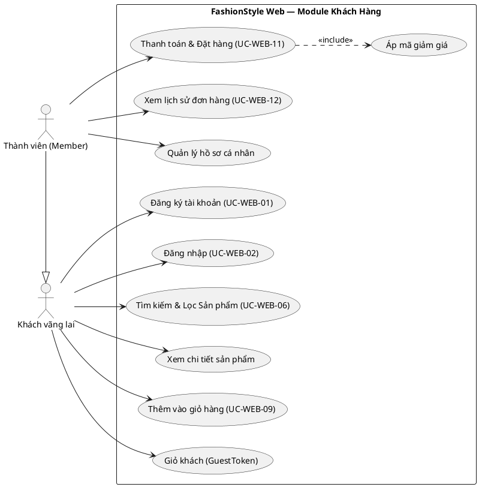
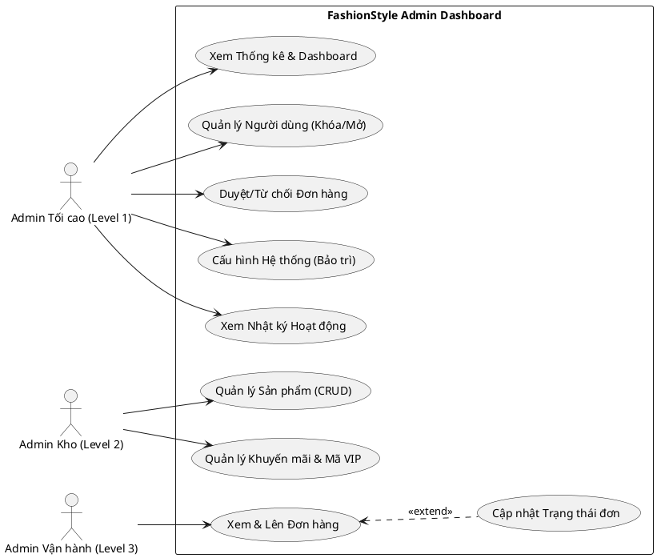
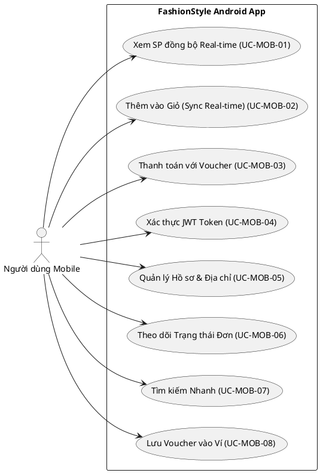
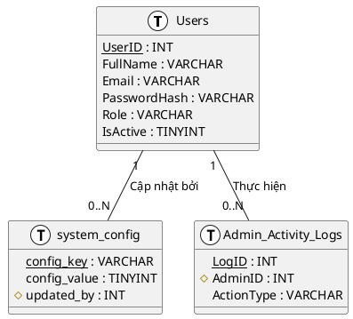
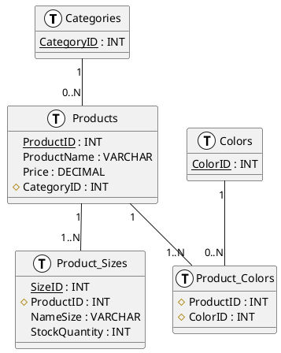
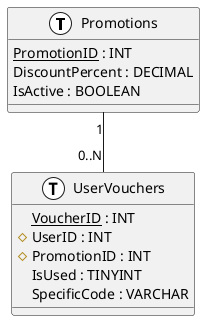
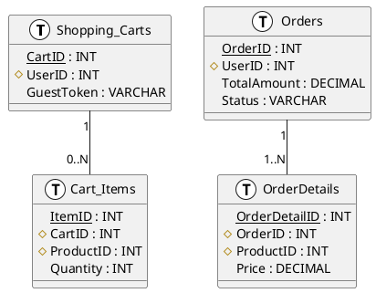

# BÁO CÁO ĐỒ ÁN TỐT NGHIỆP — TIẾNG VIỆT
## Theo hướng dẫn: Final Year Project Handbook (International Edition - V1)
## Loại đồ án: Rubric A — Phát triển Hệ thống (System Development)

> **Môn học:** CBBR4106 – Final Year Project
> **Trường:** Open University Malaysia / FPT-Greenwich
> **Chương trình:** Cử nhân Công nghệ Thông tin (Có Danh hiệu)
> **Loại dự án:** Phát triển Hệ thống Thương Mại Điện Tử + Ứng Dụng Di Động Android

---

## 📋 THỨ TỰ CÁC PHẦN TRONG BÁO CÁO (BẮT BUỘC theo Handbook)

```
1. TRANG BÌA (Title Page)
2. LỜI CAM ĐOAN (Declaration)
3. TÓM TẮT (Abstract)
4. LỜI CẢM ƠN (Acknowledgements)
5. MỤC LỤC (Table of Contents)
6. DANH SÁCH BẢNG (List of Tables)
7. DANH SÁCH HÌNH ẢNH (List of Figures)
8. DANH MỤC TỪ VIẾT TẮT (List of Abbreviations)
──────────────────────────────────────────
CHƯƠNG 1: GIỚI THIỆU
CHƯƠNG 2: PHÂN TÍCH VÀ THIẾT KẾ HỆ THỐNG
CHƯƠNG 3: CÔNG CỤ VÀ MÔI TRƯỜNG PHÁT TRIỂN PHẦN MỀM
CHƯƠNG 4: TRIỂN KHAI VÀ ĐÁNH GIÁ
CHƯƠNG 5: KẾT LUẬN
──────────────────────────────────────────
TÀI LIỆU THAM KHẢO (References)
PHỤ LỤC (Appendices)
```

> ⚠️ **Lưu ý quan trọng:** Tổng số trang từ Chương 1 đến Chương 5 phải **tối thiểu 50 trang**

---

# PHÁT TRIỂN NỀN TẢNG THƯƠNG MẠI ĐIỆN TỬ THỜI TRANG VÀ ỨNG DỤNG DI ĐỘNG ANDROID

*(Font: Arial Narrow, cỡ 18, CHỮ HOA — dùng cho trang bìa)*

**[TÊN SINH VIÊN — VIẾT HOA]**

**OPEN UNIVERSITY MALAYSIA**
**2026**

---

## LỜI CAM ĐOAN

**Họ và tên:** [Điền tên sinh viên]
**Mã số sinh viên:** [Điền mã số]

Tôi xin cam đoan rằng đồ án tốt nghiệp này là kết quả của công việc nghiên cứu độc lập của bản thân, ngoại trừ các trích dẫn và tóm tắt đã được ghi nhận đầy đủ nguồn gốc.

**Chữ ký:** __________________ &nbsp;&nbsp;&nbsp;&nbsp; **Ngày:** __________________

*(Trang này được đánh số La Mã: ii)*

---

## TÓM TẮT (ABSTRACT)

**PHÁT TRIỂN NỀN TẢNG THƯƠNG MẠI ĐIỆN TỬ THỜI TRANG VÀ ỨNG DỤNG DI ĐỘNG ANDROID**

*(Font Times New Roman, cỡ 12, giãn dòng đơn — KHÔNG QUÁ 250 TỪ)*

Đồ án này trình bày quá trình phát triển một nền tảng thương mại điện tử thời trang đa tầng có tên FashionStyle, được thiết kế nhằm cung cấp trải nghiệm mua sắm trực tuyến liền mạch trên cả nền tảng web và di động. Hệ thống được xây dựng theo kiến trúc đa tầng gồm bốn thành phần chính: REST API nền tảng Node.js, ứng dụng web khách hàng sử dụng React, bảng điều khiển quản trị viên sử dụng React, và ứng dụng di động Android xây dựng bằng React Native.

Ứng dụng di động sử dụng kiến trúc Hybrid WebView, nhúng giao diện web vào trong lớp vỏ native Android để cung cấp trải nghiệm đồng nhất. Hệ thống triển khai phân quyền ba cấp quản trị viên, quy trình xử lý đơn hàng tự động với thông báo email, hệ thống mã khuyến mãi VIP dùng một lần cá nhân hóa, và mô-đun cấu hình hệ thống theo thời gian thực.

**Từ khóa:** Thương mại điện tử, React Native, WebView, Node.js, Full-Stack, Ứng dụng di động

---

## LỜI CẢM ƠN

Tôi xin gửi lời cảm ơn chân thành đến giảng viên hướng dẫn **[Tên thầy/cô]** đã tận tình hỗ trợ và định hướng trong suốt quá trình thực hiện đồ án này.

Tôi cũng xin gửi lời cảm ơn đến gia đình và bạn bè đã luôn ủng hộ và động viên tôi trong những lúc khó khăn. Nếu không có sự hỗ trợ của các bên đã đề cập, tôi không thể hoàn thành đồ án này một cách thành công.

**XIN CHÂN THÀNH CẢM ƠN.**

**[TÊN SINH VIÊN]**
*Ngày 28 tháng 3 năm 2026*

---

## MỤC LỤC

| Phần | Trang |
|------|-------|
| LỜI CAM ĐOAN | ii |
| TÓM TẮT | iii |
| LỜI CẢM ƠN | iv |
| MỤC LỤC | v |
| DANH SÁCH BẢNG | vi |
| DANH SÁCH HÌNH ẢNH | vii |
| DANH MỤC TỪ VIẾT TẮT | viii |
| **CHƯƠNG 1: GIỚI THIỆU** | 1 |
| 1.1 Bối cảnh nghiên cứu | 1 |
| 1.2 Xác định vấn đề | 2 |
| 1.3 Mục tiêu nghiên cứu | 3 |
| 1.4 Phạm vi và giới hạn | 4 |
| 1.5 Kế hoạch thực hiện | 5 |
| **CHƯƠNG 2: PHÂN TÍCH VÀ THIẾT KẾ HỆ THỐNG** | 6 |
| 2.1 Nghiên cứu tính khả thi | 6 |
| 2.2 Phương pháp phân tích yêu cầu | 8 |
| 2.3 Phương pháp phát triển hệ thống | 10 |
| 2.4 Sơ đồ Mô hình hóa Dữ liệu và Quy trình | 11 |
| 2.5 Thiết kế Cơ sở dữ liệu | 13 |
| 2.6 Thiết kế Giao diện | 18 |
| **CHƯƠNG 3: CÔNG CỤ VÀ MÔI TRƯỜNG PHÁT TRIỂN PHẦN MỀM** | 22 |
| 3.1 Ngôn ngữ & Framework Lập trình | 22 |
| 3.2 Hệ quản trị Cơ sở dữ liệu | 24 |
| 3.3 Công cụ và Môi trường (IDEs) | 25 |
| 3.4 Thư viện tích hợp cốt lõi | 26 |
| **CHƯƠNG 4: TRIỂN KHAI VÀ ĐÁNH GIÁ** | 28 |
| 4.1 Triển khai và Cài đặt Hệ thống | 28 |
| 4.2 Triển khai các chức năng cốt lõi | 31 |
| 4.3 Hướng dẫn sử dụng hệ thống | 33 |
| 4.4 Kế hoạch Kiểm thử & Kết quả | 37 |
| **CHƯƠNG 5: KẾT LUẬN** | 42 |
| 5.1 Tóm tắt các kết quả chính | 42 |
| 5.2 Thảo luận & Ý nghĩa thực tiễn | 43 |
| 5.3 Hạn chế của hệ thống | 44 |
| 5.4 Hướng phát triển trong tương lai | 45 |
| TÀI LIỆU THAM KHẢO | 59 |
| PHỤ LỤC | 61 |

---

## DANH SÁCH BẢNG

| Bảng | Tiêu đề | Trang |
|------|---------|-------|
| Bảng 2.1 | Yêu cầu chức năng (YC01–YC10) | 17 |
| Bảng 2.2 | Yêu cầu phi chức năng (YCP01–YCP05) | 18 |
| Bảng 2.3 | Phân tích chi phí – lợi ích | 16 |
| Bảng 2.4 | Kế hoạch thực hiện (7 giai đoạn) | 19 |
| Bảng 2.5 | Lược đồ cơ sở dữ liệu — Bảng Users | 26 |
| Bảng 2.6 | Lược đồ cơ sở dữ liệu — Bảng Products | 26 |
| Bảng 2.7 | Lược đồ cơ sở dữ liệu — Bảng Orders | 27 |
| Bảng 2.8 | Lược đồ cơ sở dữ liệu — Bảng UserVouchers | 27 |
| Bảng 3.1 | Yêu cầu phần mềm cài đặt | 30 |
| Bảng 4.1 | Kiểm thử — Module xác thực (UC-WEB-01, UC-WEB-02) | 44 |
| Bảng 4.2 | Kiểm thử — Module quản lý sản phẩm (UC-WEB-06, UC-WEB-07) | 46 |
| Bảng 4.3 | Kiểm thử — Module xử lý đơn hàng (UC-WEB-11, UC-WEB-12) | 48 |
| Bảng 4.4 | Kiểm thử — Module quản trị (UC-ADM-01 đến UC-ADM-08) | 50 |

---

## DANH SÁCH HÌNH ẢNH

| Hình | Tiêu đề | Trang |
|------|---------|-------|
| Hình 2.1 | Sơ đồ Kiến Trúc Hệ Thống Đa Tầng (Multi-Tier) | 14 |
| Hình 2.2 | Sơ đồ Use Case — Khách hàng / Khách vãng lai (UC-WEB-01 đến UC-WEB-12) | 18 |
| Hình 2.3 | Sơ đồ Use Case — Quản trị viên: Cấp 1, 2, 3 (UC-ADM-01 đến UC-ADM-08) | 19 |
| Hình 2.4 | Sơ đồ Use Case — Người dùng Ứng dụng Di động (UC-MOB-01 đến UC-MOB-06) | 20 |
| Hình 2.5 | Sơ đồ Luồng Dữ Liệu (DFD) Mức 0 | 21 |
| Hình 2.6 | ERD — Nhóm 1: Quản lý Hệ thống & Người dùng (Users, User_Password_Reset, Admin_Activity_Logs, System_Config, Notifications) | 22 |
| Hình 2.7 | ERD — Nhóm 2: Quản lý Sản phẩm (Categories, Products, Product_Costs, Product_Sizes, Colors, Product_Colors, Image) | 23 |
| Hình 2.8 | ERD — Nhóm 3: Khuyến mãi & Tương tác (Promotions, Promotions_Code, UserVouchers, Reviews) | 24 |
| Hình 2.9 | ERD — Nhóm 4: Mua sắm & Giao dịch (Shopping_Carts, Cart_Items, Orders, OrderDetails, Payment_Transactions) | 25 |
| Hình 2.10 | Thiết kế giao diện — Trang chủ khách hàng | 28 |
| Hình 2.11 | Thiết kế giao diện — Trang chi tiết sản phẩm | 29 |
| Hình 2.12 | Thiết kế giao diện — Bảng điều khiển Admin | 30 |
| Hình 2.13 | Thiết kế giao diện — Ứng dụng di động Android | 31 |
| Hình 4.1 | Ảnh chụp thực tế — Trang chủ khách hàng | 38 |
| Hình 4.2 | Ảnh chụp thực tế — Trang chi tiết sản phẩm | 39 |
| Hình 4.3 | Ảnh chụp thực tế — Bảng điều khiển Admin | 41 |
| Hình 4.4 | Ảnh chụp thực tế — Ứng dụng Android trên máy ảo | 43 |

---

## DANH MỤC TỪ VIẾT TẮT

| Từ viết tắt | Nghĩa đầy đủ |
|------------|--------------|
| API | Giao diện lập trình ứng dụng (Application Programming Interface) |
| APK | Gói ứng dụng Android (Android Package Kit) |
| ADB | Cầu nối gỡ lỗi Android (Android Debug Bridge) |
| CRUD | Tạo, Đọc, Cập nhật, Xóa (Create, Read, Update, Delete) |
| DFD | Sơ đồ Luồng Dữ Liệu (Data Flow Diagram) |
| ERD | Sơ đồ Thực Thể Liên Kết (Entity Relationship Diagram) |
| HTTP | Giao thức Truyền Siêu Văn Bản (Hypertext Transfer Protocol) |
| JWT | Mã thông báo JSON Web (JSON Web Token) |
| OUM | Đại học Mở Malaysia (Open University Malaysia) |
| REST | Kiểu kiến trúc Truyền Trạng Thái Đại Diện (Representational State Transfer) |
| SDLC | Vòng đời Phát triển Phần mềm (Software Development Life Cycle) |
| SQL | Ngôn ngữ Truy vấn Có Cấu trúc (Structured Query Language) |
| UI | Giao diện Người dùng (User Interface) |
| UX | Trải nghiệm Người dùng (User Experience) |

---

---

# CHƯƠNG 1: GIỚI THIỆU

## 1.1 Bối Cảnh Nghiên Cứu

Sự phát triển nhanh chóng của thương mại điện tử đã thay đổi căn bản cách người tiêu dùng mua sắm hàng hóa và dịch vụ trên toàn cầu. Theo Statista (2024), doanh thu thương mại điện tử toàn cầu dự kiến vượt 7 nghìn tỷ USD vào năm 2025, được thúc đẩy bởi sự phổ biến ngày càng tăng của điện thoại thông minh và kết nối internet tại cả thị trường phát triển lẫn đang phát triển. Tại Việt Nam, nền kinh tế số đã phát triển mạnh mẽ, với bán lẻ trực tuyến trở thành kênh chủ đạo cho các sản phẩm thời trang và phong cách sống trong nhóm người tiêu dùng từ 18 đến 45 tuổi.

Ngành thời trang và trang phục là một trong những lĩnh vực cạnh tranh và năng động nhất trong thương mại điện tử. Các nền tảng toàn cầu lớn như Shopify, WooCommerce và các đại gia khu vực như Shopee, Lazada đã đặt ra kỳ vọng cao về trải nghiệm mua sắm liền mạch, tích hợp trên cả web và di động. Tuy nhiên, nhiều doanh nghiệp thời trang vừa và nhỏ (SME) tại Việt Nam vẫn thiếu các giải pháp kỹ thuật số tích hợp đủ khả năng và giá cả hợp lý (Laudon & Traver, 2021).

Cụ thể, nhiều nhà bán lẻ thời trang địa phương vận hành mà không có hệ thống quản lý thống nhất, dẫn đến hành trình khách hàng bị phân mảnh, khó kiểm soát tồn kho và tốn nhiều công sức thủ công trong quản lý đơn hàng. Sự vắng mặt của ứng dụng di động khiến các doanh nghiệp này bỏ lỡ một phân khúc ngày càng lớn của người tiêu dùng ưu tiên di động — những người thích duyệt và mua sắm qua điện thoại. Nghiên cứu cho thấy thương mại di động chiếm hơn 60% lưu lượng thương mại điện tử toàn cầu (Statista, 2024), nhấn mạnh tính cấp bách về mặt thương mại của việc SME áp dụng các giải pháp mobile-ready.

Đồ án **FashionStyle** này giải quyết trực tiếp các thách thức đó bằng cách phát triển một giải pháp thương mại điện tử full-stack toàn diện. Nền tảng này tích hợp ứng dụng web dành cho khách hàng, bảng điều khiển quản trị viên và ứng dụng di động Android, tất cả được hỗ trợ bởi một backend API tập trung và cơ sở dữ liệu MySQL. Bằng cách tận dụng các công nghệ mã nguồn mở hiện đại bao gồm Node.js, React 18 và React Native 0.84.1, FashionStyle cung cấp một giải pháp có thể mở rộng, bảo trì được và khả thi về mặt thương mại mà SME có thể triển khai và vận hành với tài nguyên kỹ thuật tối thiểu.

Hệ thống áp dụng kiến trúc Hybrid WebView cho ứng dụng Android, nhúng giao diện web phản hồi đầy đủ bên trong một shell Android native bằng React Native. Cách tiếp cận này loại bỏ nhu cầu phát triển và bảo trì hai codebase riêng biệt cho web và di động, giảm đáng kể chi phí phát triển và thời gian đưa sản phẩm ra thị trường — lợi thế then chốt cho các doanh nghiệp nhỏ có nguồn lực hạn chế.

## 1.2 Xác Định Vấn Đề

Dù thương mại điện tử ngày càng phổ biến, các nhà bán lẻ thời trang vừa và nhỏ vẫn tiếp tục đối mặt với hàng loạt thách thức vận hành và kỹ thuật cản trở khả năng cạnh tranh của họ trên thị trường số:

**Vấn đề 1 — Thiếu Trải Nghiệm Di Động Tích Hợp:**
Hầu hết các trang web của nhà bán lẻ nhỏ không được tối ưu hóa cho thiết bị di động, dẫn đến trải nghiệm người dùng kém và tỷ lệ chuyển đổi từ di động thấp. Việc thiếu ứng dụng di động chuyên biệt khiến doanh nghiệp bỏ lỡ cơ hội doanh thu đáng kể từ người tiêu dùng ưu tiên di động. Người dùng trên trình duyệt di động thường xuyên gặp vấn đề về layout, điều hướng chậm và tính năng tương tác hạn chế so với trải nghiệm trên máy tính.

**Vấn đề 2 — Quản Lý Đơn Hàng Không Hiệu Quả và Thủ Công:**
Không có hệ thống quản lý đơn hàng tích hợp, nhà bán lẻ phụ thuộc vào quy trình thủ công — điện thoại, bảng tính, ứng dụng nhắn tin — để xử lý xác nhận đơn, cập nhật trạng thái và giao tiếp với khách hàng. Quy trình thủ công này đễ xảy ra lỗi, tốn thời gian và tạo ra sự chậm trễ không chấp nhận được trong giao tiếp với khách hàng, ảnh hưởng tiêu cực đến sự hài lòng và tỷ lệ mua hàng lặp lại.

**Vấn đề 3 — Kiểm Soát Tồn Kho Không Đầy Đủ (Theo Kích Thước và Màu Sắc):**
Bán lẻ thời trang đòi hỏi theo dõi chính xác tồn kho theo cả kích thước (S, M, L, XL) và màu sắc. Không có hệ thống quản lý tồn kho chuyên sâu, doanh nghiệp thường xuyên gặp tình trạng bán vượt kho, thực hiện sai đơn hàng và sai lệch tồn kho. Điều này dẫn đến khiếu nại, hàng trả lại và tổn hại uy tín.

**Vấn đề 4 — Thiếu Hệ Thống Khuyến Mãi Cá Nhân Hóa:**
Marketing kỹ thuật số hiệu quả đòi hỏi khả năng tạo các chiến dịch khuyến mãi nhắm mục tiêu, cá nhân hóa. Nhà bán lẻ nhỏ thiếu cơ sở hạ tầng kỹ thuật để phát hành, theo dõi và xác thực mã khuyến mãi cá nhân hóa ở cấp độ khách hàng, hạn chế khả năng khen thưởng khách VIP và thúc đẩy mua hàng lặp lại.

**Vấn đề 5 — Không Có Kiểm Soát Quản Trị Tập Trung:**
Với nhiều vai trò vận hành — thu mua, chăm sóc khách hàng, logistics — nhà bán lẻ nhỏ cần phân quyền truy cập quản trị theo vai trò. Không có hệ thống admin đa tầng, hoặc tất cả nhân viên có quyền truy cập đầy đủ (tạo rủi ro bảo mật) hoặc phải dùng quy trình thủ công để phối hợp giữa các bộ phận.

## 1.3 Mục Tiêu Nghiên Cứu

Mục tiêu chính của đồ án là thiết kế, phát triển và đánh giá một nền tảng thương mại điện tử toàn diện giải quyết các vấn đề đã xác định. Các mục tiêu cụ thể là:

1. **Mục tiêu 1:** Thiết kế và phát triển nền tảng thương mại điện tử full-stack gồm REST API backend (Node.js + Express.js), ứng dụng web khách hàng (React 18) và bảng điều khiển quản trị viên theo vai trò (React 19 + PrimeReact), cho phép quản lý danh mục sản phẩm, giỏ hàng và xử lý đơn hàng từ đầu đến cuối.

2. **Mục tiêu 2:** Phát triển ứng dụng di động Android sử dụng React Native 0.84.1, tận dụng kiến trúc Hybrid WebView để nhúng giao diện web phản hồi bên trong shell Android native, cung cấp trải nghiệm mua sắm di động liền mạch mà không tốn chi phí bảo trì codebase di động riêng.

3. **Mục tiêu 3:** Triển khai hệ thống Kiểm Soát Truy Cập Dựa Trên Vai Trò (RBAC) hỗ trợ ba cấp độ quản trị viên riêng biệt — Admin Cấp 1 (Tổng), Admin Cấp 2 (Kho Hàng) và Admin Cấp 3 (Vận Hành) — mỗi cấp có chức năng được giới hạn chính xác để đảm bảo bảo mật và hiệu quả vận hành.

4. **Mục tiêu 4:** Phát triển quy trình quản lý đơn hàng tự động, bất đồng bộ, kích hoạt thông báo email định dạng HTML tới cả khách hàng và quản trị viên khi đặt hàng và thay đổi trạng thái, sử dụng Nodemailer tích hợp với Gmail SMTP.

5. **Mục tiêu 5:** Triển khai hệ thống mã khuyến mãi VIP cá nhân hóa, sử dụng một lần, liên kết với tài khoản cá nhân qua bảng `UserVouchers`, đảm bảo mã không thể chuyển giữa tài khoản hoặc dùng lại sau khi đã sử dụng.

## 1.4 Phạm Vi Và Giới Hạn

### Phạm vi

Hệ thống FashionStyle bao gồm các lĩnh vực chức năng sau trong phạm vi đồ án:

**Module Khách Hàng:**
- Đăng ký tài khoản với xác thực email và họ tên
- Đăng nhập với quản lý phiên dựa trên JWT (hết hạn 7 ngày)
- Duyệt sản phẩm theo danh mục, màu sắc, khoảng giá và tìm kiếm từ khóa
- Xem chi tiết sản phẩm với chọn kích thước và màu sắc
- Quản lý giỏ hàng cho cả người dùng đã xác thực (JWT) và khách vãng lai (giỏ ẩn danh dựa trên GuestToken)
- Quy trình thanh toán hỗ trợ Thanh Toán Khi Nhận Hàng (COD) và thanh toán ngân hàng mô phỏng
- Áp dụng mã khuyến mãi và tính lại tổng đơn hàng theo thời gian thực
- Lịch sử đơn hàng và theo dõi trạng thái đơn
- Quản lý hồ sơ và đổi mật khẩu
- Giao diện song ngữ (Tiếng Anh và Tiếng Việt) qua i18next

**Module Quản Trị Viên:**
- Bảng điều khiển admin ba cấp tự động khởi tạo khi server khởi động
- Admin Cấp 1: Toàn quyền — quản lý người dùng (khóa/mở), cấu hình hệ thống (chế độ bảo trì, bật/tắt đăng ký), duyệt/từ chối đơn hàng cuối, thống kê và nhật ký toàn bộ
- Admin Cấp 2: Quản lý danh mục sản phẩm (CRUD), upload ảnh (Multer), quản lý danh mục/màu/kích thước, tạo mã khuyến mãi và gán cho VIP
- Admin Cấp 3: Quản lý hàng chờ đơn hàng, cập nhật trạng thái đơn, quy trình thực hiện đơn
- Ghi nhật ký hoạt động tất cả admin với timestamp và loại hành động

**Module Di Động:**
- APK Android xây dựng bằng React Native 0.84.1
- Hybrid WebView nhúng toàn bộ ứng dụng web khách hàng
- Chặn nút Back phần cứng (ngăn thoát app, điều hướng lịch sử WebView)
- Lưu trữ JWT token qua `domStorage` WebView (đồng bộ localStorage)
- ADB Reverse Tunnel cho kết nối phát triển cục bộ

### Giới Hạn

Các khía cạnh sau đây nằm ngoài phạm vi đồ án này:

- **Nền tảng:** Ứng dụng di động chỉ nhắm mục tiêu Android. Hỗ trợ iOS (cần macOS + Xcode) không được triển khai.
- **Cổng Thanh Toán:** Không tích hợp nhà cung cấp thanh toán thực tế (VNPay, Stripe, PayPal). Mô phỏng thanh toán chỉ để minh họa.
- **Triển Khai:** Hệ thống hoạt động trong môi trường phát triển cục bộ. Hosting cloud production (AWS, Google Cloud, Vercel) không được cấu hình.
- **Thông Báo Đẩy:** Thông báo đẩy di động qua FCM (Firebase Cloud Messaging) không được triển khai; email là kênh thông báo chính.

## 1.5 Kế Hoạch Thực Hiện (Gantt Chart)

Dự án được thực hiện qua bảy giai đoạn trong 16 tuần, theo phương pháp Phát triển Ứng dụng Nhanh (RAD) với chu kỳ thiết kế và kiểm thử lặp.

| Giai đoạn | Nội dung công việc | Thời gian | Kết quả chính |
|-----------|--------------------|-----------|-----------------|
| Giai đoạn 1 | Phân tích yêu cầu & Thiết kế hệ thống | 2 tuần | Tài liệu kiến trúc, ERD, sơ đồ Use Case |
| Giai đoạn 2 | Phát triển Backend API | 3 tuần | Node.js REST API với 13 nhóm endpoint, JWT Auth |
| Giai đoạn 3 | Phát triển Web App Khách hàng | 4 tuần | React 18 Web App (Cổng 5174), Redux Cart, Checkout |
| Giai đoạn 4 | Phát triển Admin Dashboard | 2 tuần | React 19 Admin Panel, RBAC, Dashboard thống kê |
| Giai đoạn 5 | Phát triển App Android | 2 tuần | React Native APK, WebView, ADB Tunnel |
| Giai đoạn 6 | Tích hợp hệ thống & Kiểm thử | 2 tuần | Test tích hợp, bộ test case Black Box |
| Giai đoạn 7 | Viết báo cáo & Tài liệu | 1 tuần | Báo cáo Đồ án Tốt nghiệp |
| **Tổng cộng** | | **16 tuần** | **Hệ thống FashionStyle hoàn chỉnh** |

Giai đoạn tốn nhiều thời gian nhất là Giai đoạn 3 (Phát triển Web App Khách hàng), vì thành phần này là nền tảng của giao diện ứng dụng di động và đòi hỏi thiết kế responsive cẩn thận để đảm bảo tương thích trên cả trình duyệt desktop lẫn engine hiển thị Android WebView.

---

# CHƯƠNG 2: PHÂN TÍCH VÀ THIẾT KẾ HỆ THỐNG

## 2.1 Nghiên cứu tính khả thi

### 2.1.1 Khả Thi Kỹ Thuật

Hệ thống FashionStyle sử dụng các công nghệ mã nguồn mở tiêu chuẩn công nghiệp được áp dụng rộng rãi. Node.js (v22.11.0) cung cấp I/O bất đồng bộ theo hướng sự kiện, rất phù hợp để xử lý các yêu cầu API đồng thời trong môi trường thương mại điện tử. React 18 giới thiệu khả năng Concurrent Rendering, cải thiện hiệu suất cảm nhận của người dùng. React Native 0.84.1 là framework tiêu chuẩn ngành cho phát triển di động đa nền tảng (Meta Platforms, 2024b).

Tất cả các thư viện phụ thuộc — Express.js, MySQL2, JWT, bcryptjs, Multer, Nodemailer, React Router, Redux Toolkit, Axios, PrimeReact, Zustand — đều có sẵn miễn phí qua npm. Không cần phần mềm độc quyền hay giấy phép trả phí ở bất kỳ giai đoạn nào.

Môi trường phát triển yêu cầu máy trạm Windows 10/11 với các phần mềm sau:
- Node.js v22.11.0 trở lên
- MySQL 8.0 Community Edition
- Android Studio (bản Ladybug) với Android SDK
- Visual Studio Code với extension ESLint và Prettier
- Git để quản lý phiên bản

### 2.1.2 Khả Thi Vận Hành

Hệ thống được thiết kế với sự dễ vận hành là nguyên tắc thiết kế cốt lõi. Hệ thống RBAC đảm bảo mỗi trong ba cấp quản trị viên có giao diện được giới hạn chính xác, giảm tải nhận thức, giảm thiểu thời gian đào tạo và loại bỏ rủi ro làm hỏng dữ liệu do nhân viên không có thẩm quyền.

Giao diện khách hàng được thiết kế theo nguyên tắc responsive mobile-first, đảm bảo khả năng truy cập trên tất cả kích thước màn hình từ 375px (iPhone SE) đến 1440px (desktop). Giao diện song ngữ (Tiếng Anh và Tiếng Việt) qua i18next càng mở rộng tầm hoạt động của hệ thống.

Chức năng tự động khởi tạo tài khoản admin khi server khởi động (hàm `initAdminAccounts()` trong `server.js`) đảm bảo hệ thống luôn có thể phục hồi — dù có xóa nhầm tài khoản — không cần can thiệp thủ công vào cơ sở dữ liệu.

### 2.1.3 Phân Tích Chi Phí - Lợi Ích

| Khoản mục | Chi phí ước tính |
|-----------|-----------------|
| Công cụ phát triển (VS Code, Android Studio) | Miễn phí (Nguồn mở) |
| Backend (Node.js, Express.js) | Miễn phí (Nguồn mở) |
| Frontend (React 18, React 19, Vite) | Miễn phí (Nguồn mở) |
| Mobile (React Native 0.84.1) | Miễn phí (Nguồn mở) |
| Cơ sở dữ liệu (MySQL 8.0 Community) | Miễn phí (Nguồn mở) |
| Thư viện UI (PrimeReact) | Miễn phí (Community) |
| Dịch vụ email (Nodemailer + Gmail SMTP) | Miễn phí (trong giới hạn Gmail) |
| Môi trường lưu trữ (Cục bộ) | 0 USD |
| **Tổng chi phí phát triển** | **0 USD** |

**Lợi ích định lượng được:**
- Loại bỏ quy trình theo dõi đơn hàng thủ công, ước tính tiết kiệm 2–4 giờ nhân công mỗi ngày
- Giảm sự cố bán vượt kho thông qua theo dõi tồn kho theo kích thước và màu sắc
- Mở rộng tiếp cận khách hàng qua ứng dụng di động trên nền tảng Android
- Tăng hiệu quả khuyến mãi qua mã giảm giá VIP cá nhân hóa, sử dụng một lần
- Khả năng cấu hình hệ thống theo thời gian thực (chế độ bảo trì, bật/tắt đăng ký) không cần deploy lại

## 2.2 Phương pháp phân tích yêu cầu

### 2.2.1 Yêu Cầu Chức Năng

| Mã | Yêu cầu | Ưu tiên |
|----|---------|---------|
| YC01 | Khách hàng có thể đăng ký, đăng nhập và quản lý hồ sơ | Cao |
| YC02 | Khách hàng có thể duyệt sản phẩm theo danh mục, màu sắc, giá | Cao |
| YC03 | Khách hàng có thể thêm vào giỏ hàng và thanh toán | Cao |
| YC04 | Khách vãng lai có thể thêm mặt hàng vào giỏ bằng GuestToken | Trung bình |
| YC05 | Admin 1 có thể quản lý toàn bộ cấu hình hệ thống | Cao |
| YC06 | Admin 2 có thể quản lý sản phẩm và mã khuyến mãi | Cao |
| YC07 | Admin 3 có thể xử lý và cập nhật trạng thái đơn hàng | Cao |
| YC08 | Hệ thống gửi thông báo email tự động cho đơn hàng | Cao |
| YC09 | Ứng dụng di động nhúng giao diện web trên Android | Cao |
| YC10 | Admin 1 có thể bật/tắt chế độ bảo trì qua dashboard | Trung bình |

### 2.2.2 Yêu Cầu Phi Chức Năng

| Mã | Yêu cầu |
|----|---------|
| YCP01 | Thời gian phản hồi API phải dưới 500ms |
| YCP02 | Giao diện web phải hoàn toàn responsive trên màn hình 375px1440px |
| YCP03 | JWT token của khách hàng hết hạn sau 7 ngày |
| YCP04 | JWT token của Admin không có thời hạn |
| YCP05 | Hệ thống phải hỗ trợ giao diện Tiếng Anh và Tiếng Việt |

## 2.3 Phương pháp phát triển hệ thống

Đồ án này áp dụng phương pháp **Phát triển Ứng dụng Nhanh (RAD)** kết hợp với các yếu tố của mô hình **Vòng đời Phát triển Phần mềm (SDLC)** theo mô hình Thác nước. RAD được lựa chọn do tính chất lặp lại của các yêu cầu thiết kế giao diện người dùng.

Quá trình phát triển theo 4 giai đoạn:
1. Thu thập yêu cầu và Lập kế hoạch
2. Thiết kế người dùng và Tạo mẫu thử
3. Xây dựng và Lập trình
4. Chuyển giao và Kiểm thử

## 2.4 Sơ đồ Mô hình hóa Dữ liệu và Quy trình

### 2.4.1 Sơ Đồ Kiến Trúc Hệ Thống (Hình 2.1)

Hệ thống FashionStyle được xây dựng theo kiến trúc **ba tầng (Multi-Tier Architecture)**, mỗi tầng đảm nhiệm một vai trò riêng biệt và giao tiếp qua các giao thức chuẩn.

```
╔══════════════════════════════════════════════════════════════════╗
║       TẦNG TRÌNH BÀY (Presentation Tier)                       ║
║                                                                  ║
║  ┌─────────────────┐  ┌──────────────────┐  ┌───────────────┐   ║
║  │  Web Khách Hàng │  │ Admin Dashboard  │  │FashionStyle   │   ║
║  │  (React+Vite)   │  │  (React+Vite)    │  │Android App    │   ║
║  │  Cổng: 5174    │  │  Cổng: 5173    │  │(React Native  │   ║
║  │  Tailwind CSS   │  │  PrimeReact UI   │  │ WebView)      │   ║
║  │  Redux+Axios    │  │  Zustand+Axios   │  │               │   ║
║  └────────┬────────┘  └────────┬─────────┘  └──────┬────────┘   ║
║           │  Axios HTTP        │  Axios HTTP         │ ADB Reverse║
╚═══════════╪════════════════════╪═════════════════════╪══════════╝
            │                   │                     │
            └─────────┬─────────┘                     │
                      │   HTTP REST API (JSON)         │
╔═════════════════════▼═════════════════════════════════▼══════════╗
║         TẦNG XọC LÝ (Application Tier — Business Logic)           ║
║                                                                  ║
║          Backend Project — Node.js + Express.js                  ║
║                     Cổng: 8080                                   ║
║  ┌──────────┐  ┌────────────┐  ┌──────────┐  ┌─────────────┐  ║
║  │JWT Auth  │  │13 Nhóm API│  │ Multer   │  │  Nodemailer │  ║
║  │Middleware│  │  Endpoint  │  │(Ảnh SP)  │  │(Email không │  ║
║  └──────────┘  └────────────┘  └──────────┘  │  đồng bộ) │  ║
║                                                └─────────────┘  ║
╚══════════════════════════════┬═══════════════════════════════════╝
                               │  Kết nối MySQL2 TCP
╔══════════════════════════════▼═══════════════════════════════════╗
║              TẦNG DỮ LIỆU (Data Tier)                            ║
║                                                                  ║
║               Cơ sở dữ liệu MySQL — Cổng 3306                    ║
║  Users · Products · Categories · Orders · Cart · Promotions     ║
║  Colors · Sizes · Reviews · UserVouchers · AdminLogs · Config    ║
╚══════════════════════════════════════════════════════════════════╝
```

**Mô tả:** Kiến trúc ba tầng đảm bảo phân tách rõ ràng giữa giao diện, lógic nghiệp vụ và lưu trữ dữ liệu. Tầng Trình Bày gồm 3 ứng dụng client: Web khách hàng (React 18 + Vite, cổng 5174), Admin Dashboard (React 19 + Vite + PrimeReact, cổng 5173) và ứng dụng Android (React Native 0.84.1 theo kiến trúc Hybrid WebView). Tất cả client giao tiếp với Tầng Xử Lý qua HTTP REST API dùng Axios. Tầng Xử Lý là server Node.js+Express (cổng 8080) quản lý xác thực JWT, upload file (Multer) và gửi email bất đồng bộ (Nodemailer). Tầng Dữ Liệu sử dụng MySQL 8.0 với 21 bảng đảm bảo nhất quán dữ liệu toàn hệ thống.

### 2.4.2 Sơ Đồ Use Case

**Sơ đồ Use Case — Khách Hàng (Web) — Hình 2.2**



**Sơ đồ Use Case — Quản Trị Viên (3 cấp độ) — Hình 2.3**



**Sơ đồ Use Case — Ứng Dụng Di Động — Hình 2.4**



### 2.4.3 Sơ Đồ Luồng Dữ Liệu (DFD) Mức 0 — Hình 2.5

Sơ đồ DFD Mức 0 (Sơ đồ ngữ cảnh) mô tả luồng dữ liệu cấp cao nhất giữa bốn tác nhân chính của hệ thống FashionStyle và bộ xử lý trung tâm.

```
╔═══════════════════════════════════════════════════════════════════════╗
║            SƠ ĐỒ DFD MỨC 0 — HỆ THỐNG FASHIONSTYLE                ║
╚═══════════════════════════════════════════════════════════════════════╝

  ┌──────────────┐   ① Yêu cầu duyệt/tìm kiếm SP    ╔═══════════════════╗
  │              │ ──────────────────────────────────────►║                   ║
  │  KHÁCH HÀNG  │   ② Danh sách / Chi tiết SP            ║                   ║
  │  (Web + App) │ ◄──────────────────────────────────────║                   ║
  │              │   ③ Thêm giỏ / Đặt hàng               ║   HỆ THỐNG       ║
  │              │ ──────────────────────────────────────►║  FASHIONSTYLE    ║
  │              │   ④ Xác nhận đơn + Email               ║  (API Node.js    ║
  │              │ ◄──────────────────────────────────────║   Cổng: 8080)   ║
  └──────────────┘   ⑤ Đăng ký / Đăng nhập             ║                   ║
                    ───────────────────────────────────────►║                   ║
                    ⑥ JWT Token / Phản hồi xác thực        ║                   ║
                    ◄───────────────────────────────────────║                   ║
  ┌──────────────┐   ⑦ Đăng nhập vào Admin Panel          ║                   ║
  │              │ ──────────────────────────────────────►║                   ║
  │   QUẢN TRị  │   ⑧ Thống kê / Báo cáo                  ║                   ║
  │   VIÊN (x3)  │ ◄──────────────────────────────────────║                   ║
  │              │   ⑨ Quản lý SP/ĐH/NSD                  ║                   ║
  │              │ ──────────────────────────────────────►║                   ║
  │              │   ⑩ Thay đổi cấu hình hệ thống          ║                   ║
  │              │ ──────────────────────────────────────►║                   ║
  └──────────────┘                                        ╚═══════════╤═══════╝
                                                               │
                                          ⑪ Truy vấn Read/Write │
                                                               ▼
                                                   ╔═══════════════════╗
  ┌──────────────┐   ⑫ Email Thông báo          ║                   ║
  │              │ ◄──────────────────────║     CƠ SỞD      ║
  │  DỊCH VỤ   │                        ║   DỮ LIỆU     ║
  │    EMAIL    │                        ║  (MySQL 8.0)  ║
  │ (Nodemailer)│                        ║  21 bảng      ║
  └──────────────┘                        ╚═══════════════════╝

── Mô tả các Luồng Dữ liệu ────────────────────────────────────────
  ①②  Duyệt sản phẩm: Khách hàng gửi yêu cầu; Hệ thống trả dữ liệu
  ③④  Đặt hàng: Khách gửi thông tin; Hệ thống xác nhận + gửi email
  ⑤⑥  Xác thực: Khách/Admin gửi thông tin đăng nhập; Hệ thống trả JWT
  ⑦⑧  Admin truy cập: Admin đăng nhập và lấy báo cáo thống kê
  ⑨⑩  Admin quản lý: Admin cập nhật sản phẩm/đơn/cấu hình
  ⑪   Lưu trữ: Hệ thống thực hiện các thao tác CRUD trên MySQL
  ⑫   Thông báo: Hệ thống kích hoạt Nodemailer gửi email giao dịch
```

**Phân tích luồng dữ liệu:** Khách hàng tương tác với hệ thống qua hai kênh: ứng dụng web và ứng dụng Android — cả hai giao tiếp hoàn toàn giống nhau với backend API. Toàn bộ luồng duyệt sản phẩm, quản lý giỏ hàng và đặt hàng đi qua các REST API endpoint được bảo vệ bởi JWT middleware. Hệ thống quản trị (Admin) có ba cấp độ với quyền hạn riêng biệt. Dữ liệu toàn hệ thống — sản phẩm, người dùng, đơn hàng, giỏ hàng, khuyến mãi — được lưu trong MySQL tập trung, đảm bảo nhất quán theo thời gian thực trên tất cả nền tảng.


## 2.5 Thiết kế Cơ sở dữ liệu

### Sơ Đồ ERD Tách Rời Từng Module

*(Mã PlantUML ghép Sơ đồ ERD - Nhóm Cốt Lõi & Hệ Thống)*


        

*(Mã PlantUML ghép Sơ đồ ERD - Nhóm Sản Phẩm & Biến Thể)*


        

*(Mã PlantUML ghép Sơ đồ ERD - Nhóm Khuyến Mãi & Voucher)*


        

*(Mã PlantUML ghép Sơ đồ ERD - Nhóm Đơn Hàng & Giỏ Hàng)*


        

### Lược Đồ Cơ Sở Dữ Liệu (Schemas)
**Bảng Users (Người dùng)**

| Cột | Kiểu dữ liệu | Ràng buộc |
|-----|-------------|-----------|
| UserID | INT | KHÓA CHÍNH, TỰ TĂNG |
| FullName | VARCHAR(255) | KHÔNG NULL |
| Email | VARCHAR(255) | DUY NHẤT, KHÔNG NULL |
| PasswordHash | VARCHAR(255) | KHÔNG NULL |
| Role | ENUM('Customer','Admin') | MẶC ĐỊNH 'Customer' |
| IsActive | TINYINT(1) | MẶC ĐỊNH 1 |
| CanDeleteProduct | TINYINT(1) | MẶC ĐỊNH 0 |
| CreatedAt | DATETIME | MẶC ĐỊNH THỜI GIAN HIỆN TẠI |

**Bảng Products (Sản phẩm)**

| Cột | Kiểu dữ liệu | Ràng buộc |
|-----|-------------|-----------|
| ProductID | INT | KHÓA CHÍNH, TỰ TĂNG |
| Name | VARCHAR(255) | KHÔNG NULL |
| Description | TEXT | |
| Price | DECIMAL(10,2) | KHÔNG NULL |
| CategoryID | INT | KHÓA NGOẠI → Categories |
| ImageURL | VARCHAR(500) | |
| CreatedAt | DATETIME | MẶC ĐỊNH THỜI GIAN HIỆN TẠI |

**Bảng Orders (Đơn hàng)**

| Cột | Kiểu dữ liệu | Ràng buộc |
|-----|-------------|-----------|
| OrderID | INT | KHÓA CHÍNH, TỰ TĂNG |
| UserID | INT | KHÓA NGOẠI → Users |
| TotalAmount | DECIMAL(10,2) | KHÔNG NULL |
| Status | VARCHAR(50) | MẶC ĐỊNH 'PENDING' |
| PaymentMethod | VARCHAR(50) | |
| ShippingAddress | TEXT | |
| CreatedAt | DATETIME | MẶC ĐỊNH THỜI GIAN HIỆN TẠI |

**Bảng UserVouchers (Phiếu giảm giá VIP)**

| Cột | Kiểu dữ liệu | Ràng buộc |
|-----|-------------|-----------|
| VoucherID | INT | KHÓA CHÍNH, TỰ TĂNG |
| UserID | INT | KHÓA NGOẠI → Users |
| PromotionID | INT | KHÓA NGOẠI → Promotions |
| IsUsed | TINYINT(1) | MẶC ĐỊNH 0 |
| AssignedAt | DATETIME | MẶC ĐỊNH THỜI GIAN HIỆN TẠI |

## 2.6 Thiết kế Giao diện
*( Chèn screenshots hoặc wireframes của các màn hình chính: Trang chủ, Chi tiết sản phẩm, Giỏ hàng, Thanh toán, Admin Dashboard, App di động)*


# CHƯƠNG 3: CÔNG CỤ VÀ MÔI TRƯỜNG PHÁT TRIỂN PHẦN MỀM

## 3.1 Ngôn ngữ & Framework Lập trình

### 3.1.1 Backend: Node.js và Express.js

Backend của hệ thống FashionStyle được xây dựng trên **Node.js (v22.11.0)**, một runtime JavaScript thực thi mã bên ngoài trình duyệt sử dụng engine V8 của Google. Node.js đặc biệt phù hợp cho các ứng dụng I/O chuyên sâu như API thương mại điện tử vì kiến trúc bất đồng bộ theo hướng sự kiện (non-blocking event-driven), cho phép xử lý hàng nghìn kết nối HTTP đồng thời mà không cần tạo thread OS tốn kém (OpenJS Foundation, 2024).

**Express.js** được sử dụng làm HTTP server framework. Express cung cấp lớp routing tối giản, không áp đặt cấu trúc, ánh xạ các yêu cầu HTTP đến (GET, POST, PUT, DELETE, PATCH) tới các hàm xử lý. Backend FashionStyle được cấu trúc thành **13 nhóm API route**, mỗi nhóm chịu trách nhiệm một lĩnh vực riêng: xác thực, sản phẩm, danh mục, màu sắc, giỏ hàng, đơn hàng, khuyến mãi, người dùng, thống kê, đánh giá, nhật ký admin, thông báo và cấu hình hệ thống.

### 3.1.2 Frontend (Web): React 18 và Vite

Ứng dụng web khách hàng được xây dựng bằng **React 18** với công cụ build **Vite**. React là thư viện JavaScript component-based được Meta Platforms (2024a) duy trì, cho phép xây dựng giao diện người dùng động theo cách khai báo thông qua virtual DOM.

Các tính năng React 18 chính được tận dụng trong dự án này:
- **Concurrent Rendering:** Cải thiện hiệu suất cảm nhận bằng cách cho phép React ngắt và tiếp tục công việc render.
- **Automatic Batching:** Gộp nhiều cập nhật state vào một chu kỳ re-render duy nhất, giảm thao tác DOM không cần thiết.
- **React Router v6:** Cho phép điều hướng client-side giữa các trang (Trang chủ, Shop, Chi tiết SP, Giỏ hàng, Thanh toán, Lịch sử đơn) không cần tải lại toàn bộ trang.

**Vite** phục vụ như server phát triển frontend và công cụ build, cung cấp Hot Module Replacement (HMR) gần như tức thì, cải thiện đáng kể năng suất phát triển.

**Redux Toolkit** quản lý state toàn cục cho slice xác thực (trạng thái đăng nhập người dùng và JWT token) và slice giỏ hàng (mặt hàng, số lượng, tổng tiền). **Axios** được cấu hình với instance dùng chung trỏ đến base URL của backend API (`http://localhost:8080/api`), đảm bảo xử lý header và lỗi nhất quán cho tất cả các lệnh gọi API.

### 3.1.3 Phát Triển Di Động: React Native 0.84.1 (Hybrid WebView)

Ứng dụng Android được phát triển bằng **React Native 0.84.1**, framework tiêu chuẩn ngành cho phát triển di động đa nền tảng (Meta Platforms, 2024b). Ứng dụng áp dụng **Kiến Trúc Hybrid WebView**, trong đó toàn bộ ứng dụng web khách hàng được nhúng bên trong shell Android native sử dụng gói `react-native-webview` (React Native Community, 2024).

Quyết định kiến trúc này dựa trên các lý do sau:
1. **Tái Sử Dụng Code:** Frontend web (React 18) phục vụ cả giao diện web desktop lẫn giao diện ứng dụng di động, loại bỏ nhu cầu codebase UI di động riêng.
2. **Cập Nhật Tức Thì:** Mọi thay đổi triển khai cho web server ngay lập tức phản ánh trong app di động mà không cần phát hành APK mới.
3. **ADB Reverse Tunnel:** Trong quá trình phát triển, chuyển tiếp cổng ADB (Android Debug Bridge) cho phép Android emulator tiếp cận các server phát triển cục bộ trên máy tính.

Triển khai native chính trong `App.tsx` bao gồm:
- `BackHandler.addEventListener` để chặn nút Back phần cứng
- `domStorageEnabled={true}` cho phép WebView dùng `localStorage` để lưu JWT token
- Component spinner loading chỉ hiển thị trong lần tải trang đầu tiên
- Màn hình lỗi tùy chỉnh cho lỗi HTTP và lỗi mạng

## 3.2 Hệ Quản Trị Cơ Sở Dữ Liệu: MySQL 8.0

**MySQL 8.0** phục vụ như hệ quản trị cơ sở dữ liệu quan hệ (RDBMS) cho nền tảng FashionStyle. MySQL được lựa chọn thay vì các giải pháp thay thế (PostgreSQL, MongoDB, SQLite) vì những lý do sau:

1. **Tuân Thủ ACID:** MySQL 8.0 với storage engine InnoDB đảm bảo Atomicity, Consistency, Isolation và Durability cho tất cả giao dịch. Điều này quan trọng cho việc đặt hàng và đổi mã khuyến mãi, nơi thất bại một phần có thể gây không nhất quán dữ liệu.

2. **Mô Hình Dữ Liệu Quan Hệ:** Lĩnh vực kinh doanh FashionStyle ánh xạ tự nhiên vào schema quan hệ. Sản phẩm có danh mục; đơn hàng có mục đơn hàng tham chiếu sản phẩm; user voucher liên kết người dùng với khuyến mãi. Ràng buộc khóa ngoại đảm bảo tính toàn vẹn tham chiếu ở cấp cơ sở dữ liệu.

3. **Connection Pooling:** Driver Node.js `mysql2` được cấu hình với connection pool (`db.js`), cho phép backend tái sử dụng kết nối cơ sở dữ liệu đã thiết lập thay vì tạo kết nối TCP mới cho mỗi truy vấn, cải thiện đáng kể thông lượng API.

Schema cơ sở dữ liệu gồm **21 bảng** được tổ chức thành năm nhóm chức năng:

| Nhóm | Bảng | Mục đích |
|------|------|---------|
| Hệ thống & Người dùng | Users, Admin_Activity_Logs, system_config | Xác thực, RBAC, cài đặt hệ thống |
| Sản phẩm & Biến thể | Products, Categories, Colors, Product_Colors, Product_Sizes | Danh mục và tồn kho |
| Khuyến mãi | Promotions, UserVouchers | Mã giảm giá và gán VIP |
| Giỏ hàng & Khách | Shopping_Carts, Cart_Items | Giỏ hàng cố định cho người dùng và khách |
| Đơn hàng & Tài chính | Orders, OrderDetails, OrderHistoryLog | Hồ sơ giao dịch |

## 3.3 Công Cụ và Môi Trường (IDEs)

### 3.3.1 Visual Studio Code
**Visual Studio Code (VS Code)** là trình soạn thảo mã chính được sử dụng suốt dự án. Hệ sinh thái extension phong phú của nó cung cấp auto-completion IntelliSense, kiểm soát Git tích hợp và highlight lỗi theo thời gian thực qua ESLint. Các extension chính:
- **ESLint:** Áp dụng quy tắc chất lượng code JavaScript/TypeScript.
- **Prettier:** Định dạng code tự động khi lưu file.
- **REST Client:** Kiểm thử HTTP request ngay trong editor.
- **GitLens:** Trực quan hóa lịch sử Git nâng cao.

### 3.3.2 Android Studio (Ladybug)
**Android Studio (bản Ladybug)** được sử dụng để quản lý Android Virtual Device (AVD) emulator chạy APK Android FashionStyle trong quá trình phát triển. Emulator mô phỏng thiết bị Pixel 6 (API Level 35 — Android 15).

Cấu hình ADB Reverse Tunnel (`adb reverse tcp:8080 tcp:8080`, `adb reverse tcp:5174 tcp:5174`, `adb reverse tcp:8081 tcp:8081`) ánh xạ cổng localhost của Android emulator tới các server phát triển tương ứng chạy trên máy Windows.

### 3.3.3 Postman / Insomnia
Các endpoint API được xác thực bằng **Postman** trước khi tích hợp frontend và mobile. Tất cả 13 nhóm endpoint (auth, products, orders, v.v.) được kiểm thử về HTTP status code đúng, cấu trúc JSON response, thực thi JWT auth middleware và kiểm soát truy cập theo cấp vai trò.

### 3.3.4 Git & GitHub
Toàn bộ mã nguồn được quản lý bằng **Git** với repo từ xa trên **GitHub** tại `https://github.com/TungVuk4/Final-Project`. Git cho phép commit nguyên tử, phát triển tính năng theo nhánh và đường dẫn kiểm toán lịch sử đầy đủ.

## 3.4 Thư Viện Tích Hợp Cốt Lõi

### 3.4.1 JSON Web Tokens (JWT) và bcryptjs

**JWT (JSON Web Token)** cung cấp xác thực phi trạng thái (stateless) cho nền tảng FashionStyle. Sau khi đăng nhập thành công, backend tạo JWT token đã ký bằng `jsonwebtoken` và biến môi trường `JWT_SECRET`. Token được trả về cho client, lưu trong `localStorage` (web) hoặc `domStorage` của WebView (mobile).

Các yêu cầu xác thực tiếp theo bao gồm token trong header `Authorization: Bearer <token>`. Middleware `requireAuth` (`middlewares/auth.js`) xác thực token trên mỗi route được bảo vệ. Ba hàm middleware chuyên biệt thực thi quyền theo cấp:
- `requireAuth`: Kiểm tra xác thực cơ bản (bất kỳ người dùng hợp lệ)
- `requireAdmin`: Yêu cầu Role = 'Admin'
- `requireAdminLevel(level)`: Xác thực flags quyền admin cụ thể

**bcryptjs** mã hóa mật khẩu người dùng trước khi lưu. So sánh mật khẩu khi đăng nhập dùng `bcrypt.compare()`, đảm bảo mật khẩu văn bản thuần không bao giờ được lưu hay truyền.

**Chính sách hết hạn Token:**
- JWT khách hàng: Hết hạn sau 7 ngày (`expiresIn: '7d'`)
- JWT Admin: Không có thời hạn

### 3.4.2 Nodemailer (Dịch Vụ Email)

**Nodemailer** được tích hợp với Gmail SMTP để gửi email giao dịch định dạng HTML. Dịch vụ email hoạt động **bất đồng bộ** — nghĩa là backend API trả response cho client ngay lập tức, không chờ email gửi xong. Thiết kế này đảm bảo lỗi gửi email không ảnh hưởng đến thời gian phản hồi của API đặt hàng.

Các loại email đã triển khai:
- **Email Xác Nhận Đơn Hàng** → Gửi cho khách hàng khi đặt hàng
- **Email Cảnh Báo Đơn Mới** → Gửi cho Admin Cấp 3 khi có đơn hàng
- **Email Cập Nhật Trạng Thái** → Gửi cho khách khi Admin cập nhật trạng thái đơn
- **Email OTP Đặt Lại Mật Khẩu** → Gửi cho khách khi yêu cầu đặt lại mật khẩu

### 3.4.3 Axios, React Router, Redux và Zustand

**Axios** được cấu hình như HTTP client dùng chung cho cả web app khách hàng lẫn admin dashboard. Cấu hình dùng chung (`axios/custom.ts`) đặt `baseURL` là `http://localhost:8080/api`, đảm bảo tất cả lệnh gọi API dùng prefix endpoint nhất quán.

**React Router v6** (web) và **React Router v7** (admin) cung cấp routing phía client, cho phép điều hướng single-page application mà không tải lại trang. Protected routes chuyển hướng người dùng chưa xác thực đến trang đăng nhập.

**Redux Toolkit** quản lý state toàn cục trên web app khách hàng — cụ thể là slice `auth` (phiên người dùng) và slice `cart` (các mặt hàng trong giỏ). Trên admin dashboard, **Zustand** được dùng như giải pháp quản lý state nhẹ hơn cho auth store admin, lưu JWT token vào `localStorage`.


# CHƯƠNG 4: TRIỂN KHAI VÀ ĐÁNH GIÁ

## 4.1 Triển khai và Cài đặt Hệ thống

### Yêu Cầu Phần Mềm Cần Thiết

| Phần mềm | Phiên bản | Mục đích |
|----------|----------|---------|
| Node.js | ≥ 22.11.0 | Chạy Backend và Frontend |
| MySQL | ≥ 8.0 | Cơ sở dữ liệu |
| Android Studio | Ladybug trở lên | Máy ảo Android |
| VS Code | Mới nhất | Soạn thảo mã nguồn |
| Git | Mới nhất | Quản lý phiên bản |

### Cài Đặt Backend

```bash
# Bước 1: Clone dự án
git clone https://github.com/TungVuk4/Final-Project.git
cd "Backend Project"

# Bước 2: Cài đặt thư viện
npm install

# Bước 3: Tạo file .env với nội dung:
DB_HOST=localhost
DB_USER=root
DB_PASS=matkhaudb
DB_NAME=fashionstyle
JWT_SECRET=khoa_bi_mat_jwt
SMTP_EMAIL=email_gmail@gmail.com
SMTP_PASS=mat_khau_ung_dung

# Bước 4: Khởi động server
npm run dev
# Server chạy tại http://localhost:8080
```

### Cài Đặt Ứng Dụng Di Động Android

```bash
# Bước 1: Bật máy ảo Android (Android Studio → Device Manager → Play)

# Bước 2: Thiết lập đường hầm ADB Reverse
adb reverse tcp:8081 tcp:8081   # Metro Bundler
adb reverse tcp:8080 tcp:8080   # Backend API
adb reverse tcp:5174 tcp:5174   # Vite Web Server

# Bước 3: Khởi động Metro Bundler
cd "FashionStyleApp"
npm start

# Bước 4: Build và cài APK lên máy ảo (Terminal mới)
npm run android
```

## 4.2 Triển khai các chức năng cốt lõi

### Token Authentication và Phân quyền
Mô hình Stateless sử dụng JWT cung cấp bảo mật và duy trì phiên đăng nhập cho Khách hàng trên cả App và Web, cùng hệ thống UserVouchers dùng 1 lần. Backend sử dụng Role-based Access Control để cấp quyền Admin 3 cấp bậc.

### Giao tiếp qua lại giữa App và Web
React Native WebView được cấp một cầu nối bridge để liên lạc với các event bấm phím cứng Back của Android.

## 4.3 Hướng dẫn sử dụng hệ thống

### Ứng Dụng Web Khách Hàng (Port 5174)
*( Chèn screenshots từng bước: Đăng ký → Đăng nhập → Duyệt sản phẩm → Thêm giỏ hàng → Thanh toán → Xem lịch sử đơn)*

### Bảng Điều Khiển Quản Trị (Port 5173)

| Tài khoản | Email đăng nhập | Mật khẩu | Chức năng |
|-----------|----------------|----------|-----------|
| Admin 1 (Chính) | admin1@fashionstyle.com | Admin@123 | Toàn quyền hệ thống |
| Admin 2 (Kho) | admin2@fashionstyle.com | Admin@456 | Quản lý sản phẩm & khuyến mãi |
| Admin 3 (Vận Hành) | admin3@fashionstyle.com | Admin@789 | Xử lý đơn hàng |

*( Chèn screenshots của từng trang Admin: Dashboard, Sản phẩm, Đơn hàng, Khuyến mãi)*

### Ứng Dụng Di Động Android
*( Chèn screenshots ứng dụng chạy trên máy ảo Android: Trang chủ, Sản phẩm, Đăng nhập, Giỏ hàng)*

## 4.4 Kế hoạch Kiểm thử & Kết quả

### Phương Pháp Kiểm Thử
Đồ án này sử dụng phương pháp **Kiểm thử Hộp Đen (Black Box Testing)**, xác minh hành vi của hệ thống theo các yêu cầu chức năng mà không kiểm tra logic mã nguồn nội bộ.

### Kiểm Thử Module Xác Thực
| Mã KT | Trường hợp kiểm thử | Đầu vào | Kết quả kỳ vọng | Kết quả thực tế | Trạng thái |
|-------|--------------------|---------|-----------------|--------------------|------------|
| KT-XTH-01 | Đăng nhập khách hàng đúng thông tin | Email + Mật khẩu đúng | Chuyển đến trang chủ, JWT được lưu | Như kỳ vọng | ✅ Đạt |
| KT-XTH-02 | Đăng nhập sai mật khẩu | Mật khẩu sai | Thông báo "Email hoặc mật khẩu không đúng" | Như kỳ vọng | ✅ Đạt |
| KT-XTH-03 | Đăng nhập Admin | admin1@fashionstyle.com / Admin@123 | Chuyển đến Admin Dashboard | Như kỳ vọng | ✅ Đạt |
| KT-XTH-04 | Đăng ký email đã tồn tại | Email đã có trong DB | Thông báo lỗi "Email đã tồn tại" | Như kỳ vọng | ✅ Đạt |

### Kiểm Thử Module Đơn Hàng
| Mã KT | Trường hợp kiểm thử | Kết quả kỳ vọng | Trạng thái |
|-------|--------------------|--------------------|------------|
| KT-DH-01 | Đặt hàng khi đã đăng nhập | Đơn hàng lưu DB, email xác nhận gửi | ✅ Đạt |
| KT-DH-02 | Đặt hàng với mã khuyến mãi hợp lệ | Giảm giá được áp dụng, mã đánh dấu đã dùng | ✅ Đạt |
| KT-DH-03 | Đặt hàng với mã đã sử dụng | Thông báo "Mã đã được sử dụng" | ✅ Đạt |
| KT-DH-04 | Admin 3 cập nhật trạng thái đơn | Trạng thái cập nhật trong DB | ✅ Đạt |

### Kiểm Thử Ứng Dụng Di Động
| Mã KT | Trường hợp kiểm thử | Kết quả kỳ vọng | Trạng thái |
|-------|--------------------|--------------------|------------|
| KT-DD-01 | Khởi động app trên Android Emulator | Trang chủ FashionStyle tải trong WebView | ✅ Đạt |
| KT-DD-02 | Đăng nhập trong ứng dụng di động | JWT token lưu qua localStorage domStorage | ✅ Đạt |
| KT-DD-03 | Nhấn nút Back phần cứng Android | Điều hướng dến trang trước, không thoát app | ✅ Đạt |
| KT-DD-04 | Điều hướng đến trang sản phẩm trên di động | Giao diện responsive hiển thị đúng | ✅ Đạt |


# CHƯƠNG 5: KẾT LUẬN

## 5.1 Tóm tắt các kết quả chính

Đồ án này đã hoàn thành thành công tất cả năm mục tiêu đề ra:

1. Một nền tảng thương mại điện tử full-stack đã được thiết kế và phát triển, gồm **REST API Node.js Express**, **ứng dụng web khách hàng React** và **bảng điều khiển quản trị viên React**.
2. **Ứng dụng di động Android** được xây dựng bằng React Native 0.84.1 với kiến trúc Hybrid WebView. Mọi tính năng từ đặt hàng, thanh toán đến xem lịch sử đều được vận hành trơn tru.
3. **Hệ thống kiểm soát truy cập ba cấp** được triển khai linh hoạt.
4. **Quy trình quản lý đơn hàng tự động** gửi thông báo email bất đồng bộ qua Nodemailer.
5. **Hệ thống mã khuyến mãi VIP cá nhân hóa dùng một lần** được mã hóa và bảo mật ở cấp cơ sở dữ liệu.

## 5.2 Thảo luận & Ý nghĩa thực tiễn

Việc áp dụng kiến trúc Hybrid WebView đã chứng minh được tính ưu việt về tốc độ phát hành (Time to market) đối với một dự án lớn nhưng khan hiếm về nhân lực. Tính đồng bộ hóa real-time giúp hệ thống thống nhất hoàn toàn trên cả hai thiết bị, hỗ trợ doanh nghiệp tiết kiệm chi phí lập trình hai ứng dụng native song song. Hệ thống kiểm soát truy cập dựa trên vai trò phản ánh thiết kế an toàn nhất của một doanh nghiệp trong thực tiễn.

## 5.3 Hạn chế của hệ thống

1. **Chỉ hỗ trợ Android:** Do mới chỉ cấu hình cho file Android Manifest, ứng dụng di động hiện chỉ nhắm mục tiêu Android. Cần có cấu hình iOS/XCode riêng lẻ.
2. **Môi trường phát triển cục bộ:** Hệ thống chủ yếu được hoạt động trong môi trường local port-forwarding (ADB reverse tunnel).
3. **Cổng thanh toán thực tiễn:** Thanh toán online ở mức mô phỏng (banking, COD) và chưa có đối tác Pay Gateway như VNPAY hay Momo thực tế.

## 5.4 Hướng phát triển trong tương lai

1. **Mở rộng nền tảng iOS:** Tinh chỉnh thiết lập React Native để publish app trên TestFlight.
2. **Triển khai Production Cloud Server:** Deploy toàn bộ mô hình Node.js API và React App lên máy chủ Cloud như AWS / Vercel.
3. **Tích hợp API VNPAY/ZaloPay.**
4. **Hỗ trợ chức năng thông báo đẩy điện thoại (Push Notification SDK)** để thay thế/kết hợp cùng với thông báo Nodemailer gửi qua Mail hệ thống định kỳ.

---

## TÀI LIỆU THAM KHẢO

*(Sử dụng định dạng APA 7th Edition. Sắp xếp theo ABC dọc)*

1. Aggarwal, S. (2018). Modern web-development using ReactJS. *International Journal of Recent Research Aspects*, 5(1), 133-137.

2. Auth0. (2024). *JSON Web Tokens (JWT) introduction*. https://jwt.io/introduction

3. Chohan, M. R., Awan, M. D., & Ahmad, N. (2022). A review of cross-platform mobile app development using React Native. *Journal of Software Engineering and Applications*, 15(4), 101-115.

4. Express.js. (2024). *Express - Node.js web application framework*. https://expressjs.com/

5. Fielding, R. T. (2000). *Architectural styles and the design of network-based software architectures* [Doctoral dissertation, University of California, Irvine].

6. Google. (2024). *Android Developers: Build web apps in WebView*. https://developer.android.com/develop/ui/views/layout/webapps/webview

7. Laudon, K. C., & Traver, C. G. (2021). *E-commerce 2021-2022: Business, technology and society* (16th ed.). Pearson.

8. Meta Platforms, Inc. (2024a). *React: The library for web and native user interfaces*. https://react.dev/

9. Meta Platforms, Inc. (2024b). *React Native: Learn once, write anywhere*. https://reactnative.dev/

10. Mozilla Developer Network (MDN). (2024). *HTTP Overview*. https://developer.mozilla.org/en-US/docs/Web/HTTP/Overview

11. Nodemailer. (2024). *Nodemailer: Send emails from Node.js*. https://nodemailer.com/

12. OpenJS Foundation. (2024). *Node.js documentation*. https://nodejs.org/en/docs/

13. Oracle Corporation. (2024). *MySQL 8.0 reference manual*. https://dev.mysql.com/doc/refman/8.0/en/

14. Pressman, R. S., & Maxim, B. R. (2019). *Software engineering: A practitioner's approach* (9th ed.). McGraw-Hill Education.

15. React Native Community. (2024). *React Native WebView documentation*. https://github.com/react-native-webview/react-native-webview

16. Redux. (2024). *Redux: A predictable state container for JS apps*. https://redux.js.org/

17. Sandhu, R. S., Coyne, E. J., Feinstein, H. L., & Youman, C. E. (1996). Role-based access control models. *IEEE Computer*, 29(2), 38-47. https://doi.org/10.1109/2.485845

18. Sommerville, I. (2015). *Software engineering* (10th ed.). Pearson.

19. Tailwind Labs. (2024). *Tailwind CSS documentation*. https://tailwindcss.com/docs

20. Turban, E., Outland, J., King, D., Lee, J. K., Liang, T. P., & Turban, D. C. (2018). *Electronic commerce 2018: A managerial and social networks perspective*. Springer.

---

## PHỤ LỤC

### Phụ lục A — Mẫu Đăng Ký Đồ Án
*(Đính kèm form đã điền và có chữ ký)*

### Phụ lục B — Nhật Ký Sinh Viên (Student Log Book)
*(Đính kèm log book với chữ ký giảng viên hướng dẫn từng buổi)*

### Phụ lục C — Toàn Bộ Ảnh Chụp Màn Hình Hệ Thống

### Phụ lục D — Kho Mã Nguồn
**URL GitHub:** https://github.com/TungVuk4/Final-Project

---

