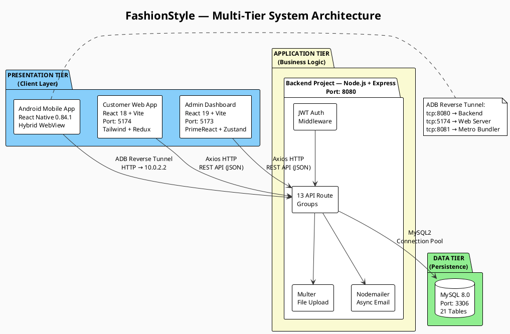
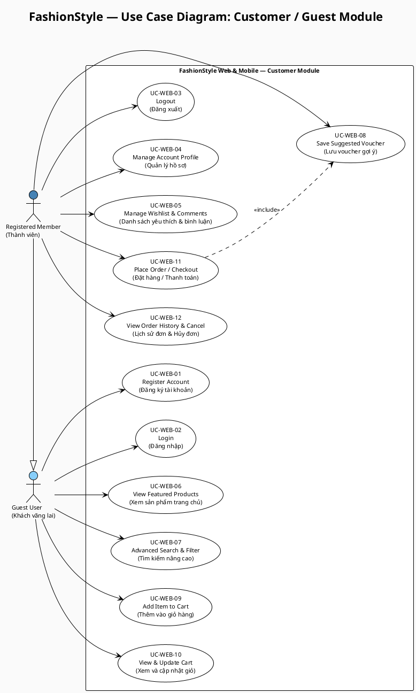
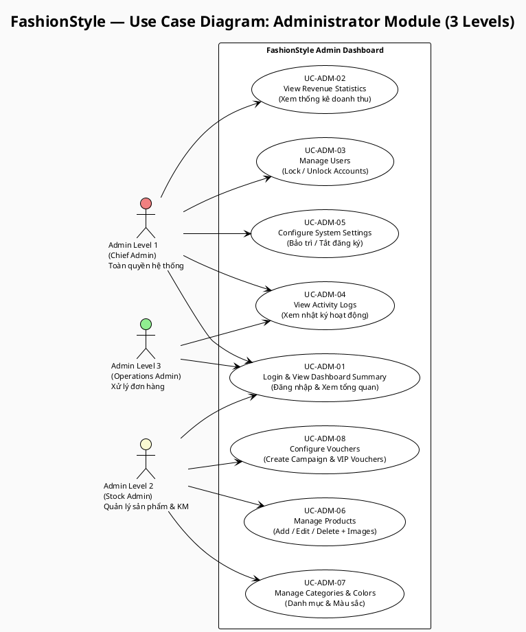
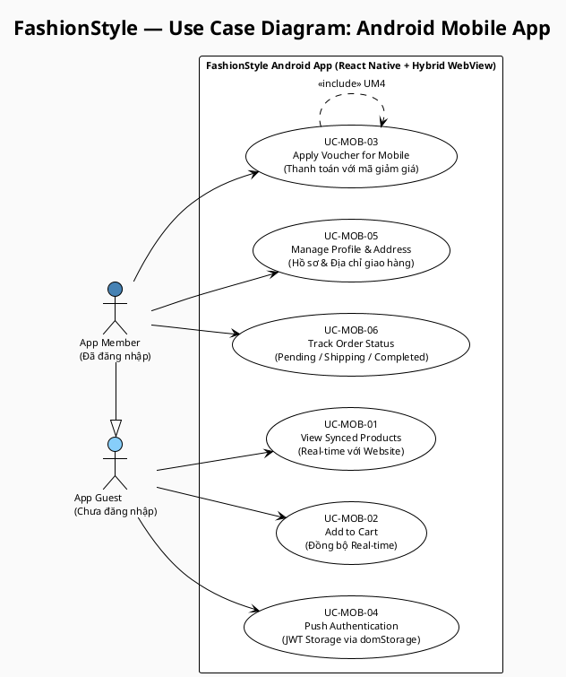
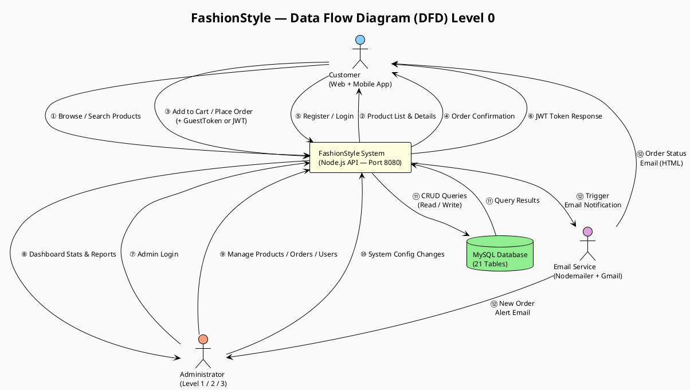
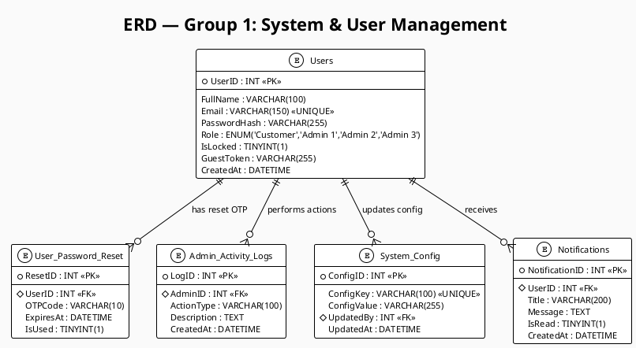
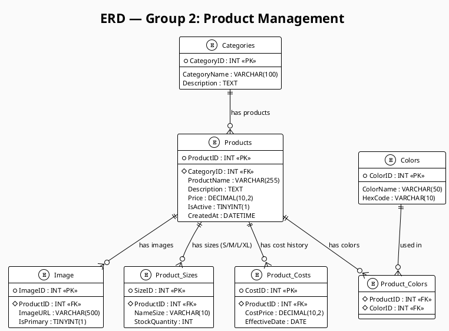
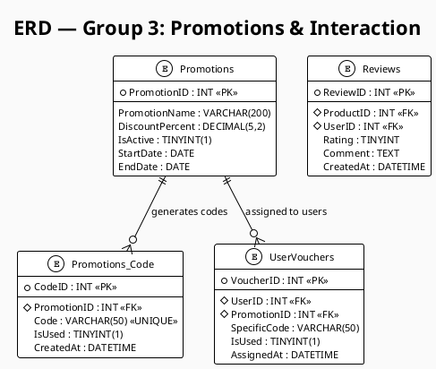
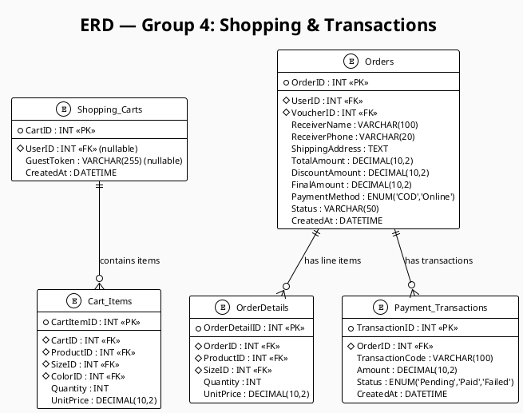

# PlantUML Diagrams — FashionStyle Project
## Hướng dẫn: Copy từng đoạn code vào https://planttext.com → Export PNG → chèn vào Word.
## Mỗi đoạn tương ứng với 1 hình trong DANH SÁCH HÌNH ẢNH của report.

---

## Hình 2.1 — Sơ đồ Kiến Trúc Hệ Thống Đa Tầng (Multi-Tier System Architecture Diagram)

---

## Hình 2.2 — Sơ đồ Use Case: Khách hàng / Khách vãng lai (UC-WEB-01 đến UC-WEB-12)
## Figure 2.2 — Use Case Diagram: Customer / Guest (UC-WEB-01 to UC-WEB-12)

---

## Hình 2.3 — Sơ đồ Use Case: Quản trị viên Cấp 1, 2, 3 (UC-ADM-01 đến UC-ADM-08)
## Figure 2.3 — Use Case Diagram: Administrator Level 1, 2, 3 (UC-ADM-01 to UC-ADM-08)

---

## Hình 2.4 — Sơ đồ Use Case: Người dùng Ứng dụng Di động (UC-MOB-01 đến UC-MOB-06)
## Figure 2.4 — Use Case Diagram: Mobile App User (UC-MOB-01 to UC-MOB-06)

---

## Hình 2.5 — Sơ đồ Luồng Dữ Liệu (DFD) Mức 0
## Figure 2.5 — Data Flow Diagram (DFD) Level 0

---

## Hình 2.6 — ERD Nhóm 1: Quản lý Hệ thống & Người dùng
## Figure 2.6 — ERD Group 1: System & User Management
### Tables: Users · User_Password_Reset · Admin_Activity_Logs · System_Config · Notifications

---

## Hình 2.7 — ERD Nhóm 2: Quản lý Sản phẩm
## Figure 2.7 — ERD Group 2: Product Management
### Tables: Categories · Products · Product_Costs · Product_Sizes · Colors · Product_Colors · Image

---

## Hình 2.8 — ERD Nhóm 3: Khuyến mãi & Tương tác
## Figure 2.8 — ERD Group 3: Promotions & Interaction
### Tables: Promotions · Promotions_Code · UserVouchers · Reviews

---

## Hình 2.9 — ERD Nhóm 4: Mua sắm & Giao dịch
## Figure 2.9 — ERD Group 4: Shopping & Transactions
### Tables: Shopping_Carts · Cart_Items · Orders · OrderDetails · Payment_Transactions

