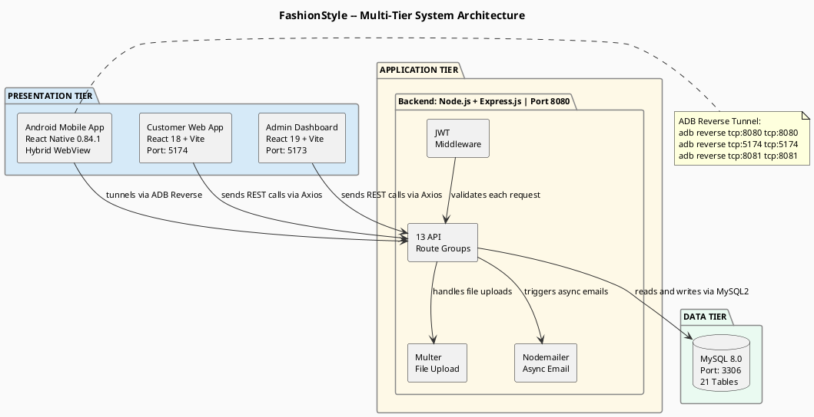
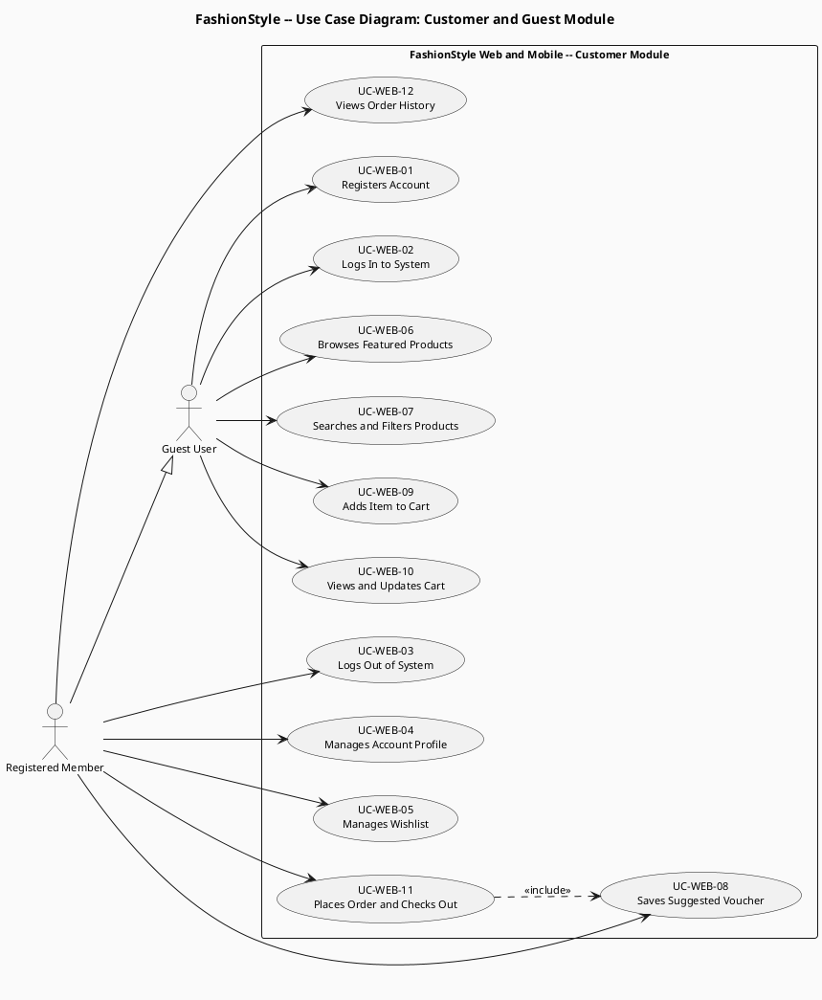
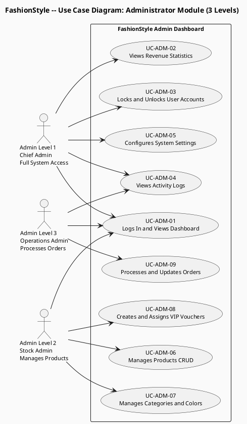
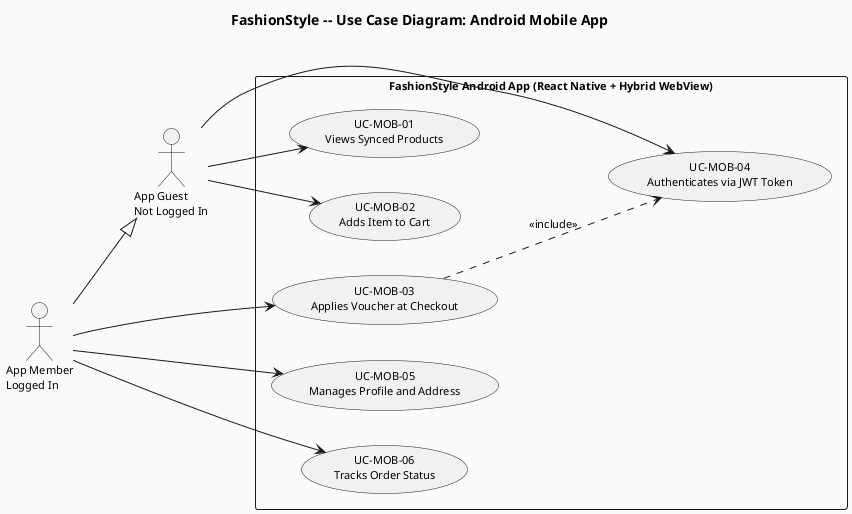
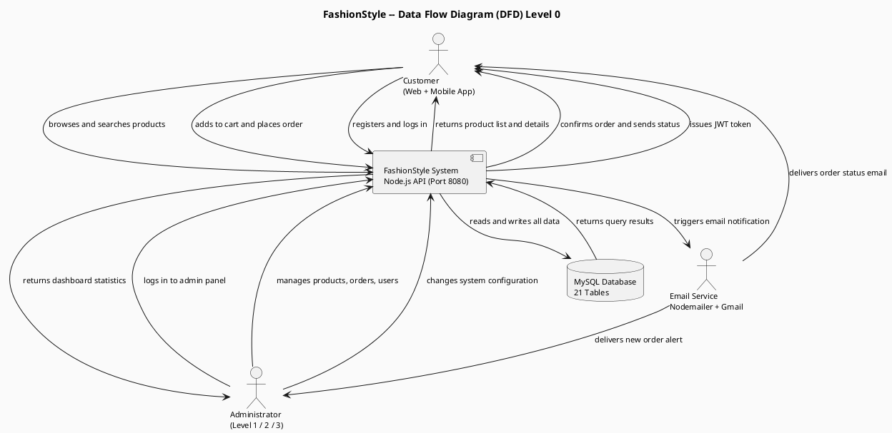
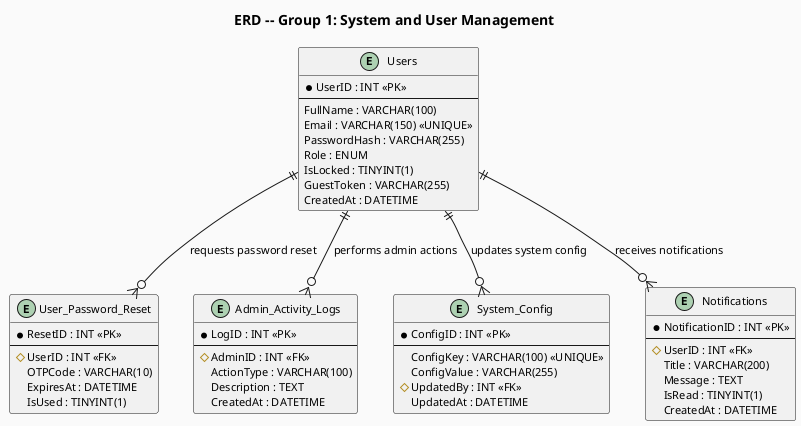
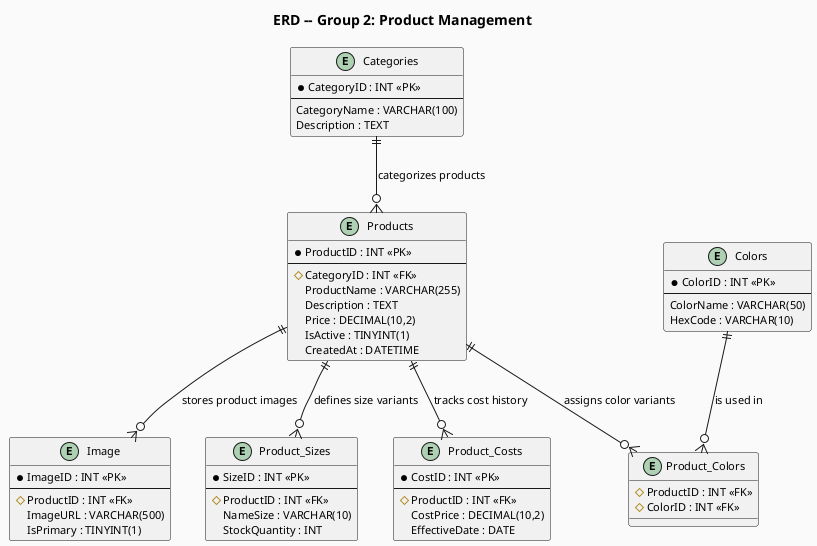
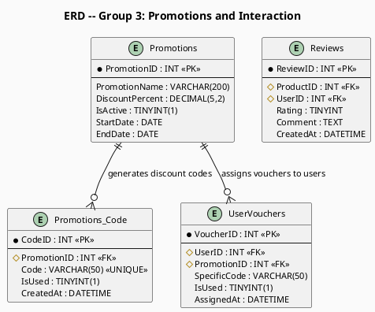
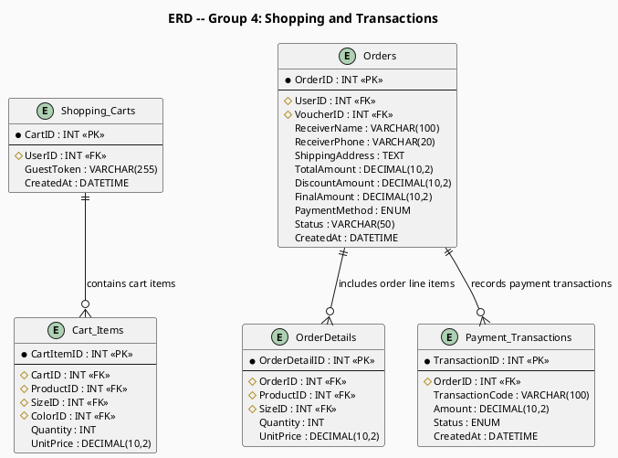

# PlantUML Diagrams — FashionStyle Project

## ⚠️ HOW TO USE: Copy ONLY the lines from @startuml to @enduml (do NOT copy the ```plantuml fences)
## Paste into: https://www.plantuml.com/plantuml/uml/ OR https://planttext.com

---

## Figure 2.1 — Multi-Tier System Architecture Diagram



---

## Figure 2.2 — Use Case Diagram: Customer and Guest Module



---

## Figure 2.3 — Use Case Diagram: Administrator Module (3 Levels)



---

## Figure 2.4 — Use Case Diagram: Android Mobile App



---

## Figure 2.5 — Data Flow Diagram (DFD) Level 0



---

## Figure 2.6 — ERD Group 1: System and User Management
### Tables: Users · User_Password_Reset · Admin_Activity_Logs · System_Config · Notifications



---

## Figure 2.7 — ERD Group 2: Product Management
### Tables: Categories · Products · Product_Costs · Product_Sizes · Colors · Product_Colors · Image



---

## Figure 2.8 — ERD Group 3: Promotions and Interaction
### Tables: Promotions · Promotions_Code · UserVouchers · Reviews



---

## Figure 2.9 — ERD Group 4: Shopping and Transactions
### Tables: Shopping_Carts · Cart_Items · Orders · OrderDetails · Payment_Transactions


